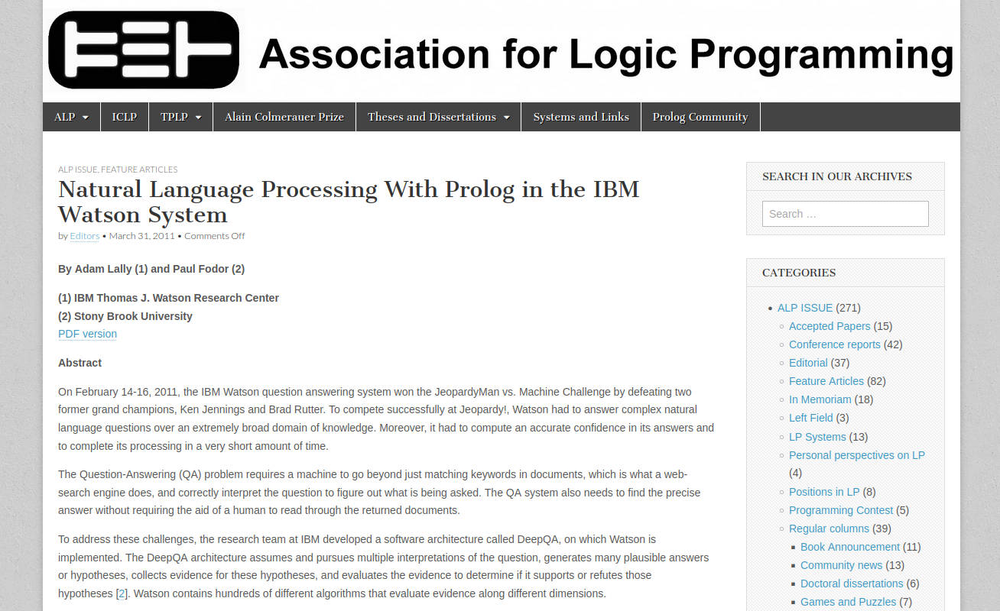
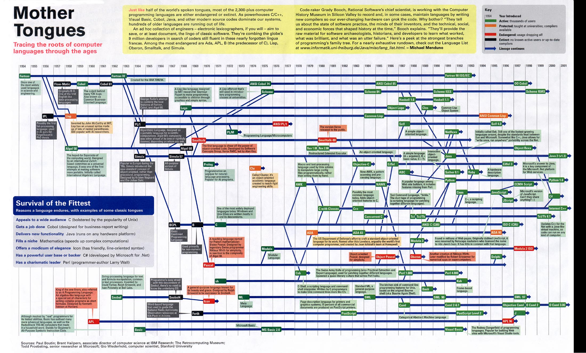
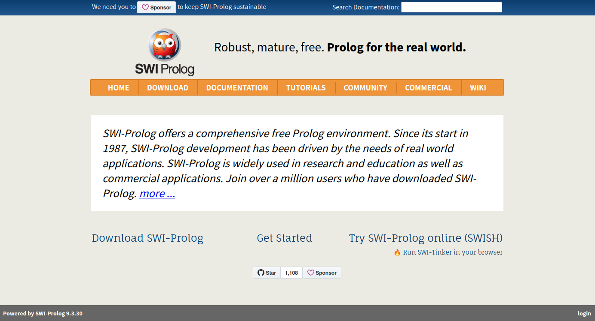

<!--
author:   Andrea Charão

email:    andrea@inf.ufsm.br

version:  0.0.1

language: PT-BR

narrator: Brazilian Portuguese Female

comment:  Material de apoio para a disciplina
          ELC117 - Paradigmas de Programação
          da Universidade Federal de Santa Maria

translation: English  translations/English.md

link:     https://cdn.jsdelivr.net/chartist.js/latest/chartist.min.css

script:   https://cdn.jsdelivr.net/chartist.js/latest/chartist.min.js

@style
.framed { border: 2px solid #ccc; border-radius: 8px; }
@end

@onload
window.CodeRunner = {
    ws: undefined,
    handler: {},
    connected: false,
    error: "",
    url: "",
    firstConnection: true,

    init(url, step = 0) {
        this.url = url
        if (step  >= 10) {
           console.warn("could not establish connection")
           this.error = "could not establish connection to => " + url
           return
        }

        this.ws = new WebSocket(url);

        const self = this
        
        const connectionTimeout = setTimeout(() => {
          self.ws.close();
          console.log("WebSocket connection timed out");
        }, 5000);
        
        
        this.ws.onopen = function () {
            clearTimeout(connectionTimeout);
            self.log("connections established");

            self.connected = true
            
            setInterval(function() {
                self.ws.send("ping")
            }, 15000);
        }
        this.ws.onmessage = function (e) {
            // e.data contains received string.

            let data
            try {
                data = JSON.parse(e.data)
            } catch (e) {
                self.warn("received message could not be handled =>", e.data)
            }
            if (data) {
                self.handler[data.uid](data)
            }
        }
        this.ws.onclose = function () {
            clearTimeout(connectionTimeout);
            self.connected = false
            self.warn("connection closed ... reconnecting")

            setTimeout(function(){
                console.warn("....", step+1)
                self.init(url, step+1)
            }, 1000)
        }
        this.ws.onerror = function (e) {
            clearTimeout(connectionTimeout);
            self.warn("an error has occurred")
        }
    },
    log(...args) {
        window.console.log("CodeRunner:", ...args)
    },
    warn(...args) {
        window.console.warn("CodeRunner:", ...args)
    },
    handle(uid, callback) {
        this.handler[uid] = callback
    },
    send(uid, message, sender=null, restart=false) {
        const self = this
        if (this.connected) {
          message.uid = uid
          this.ws.send(JSON.stringify(message))
        } else if (this.error) {

          if(restart) {
            sender.lia("LIA: terminal")
            this.error = ""
            this.init(this.url)
            setTimeout(function() {
              self.send(uid, message, sender, false)
            }, 2000)

          } else {
            //sender.lia("LIA: wait")
            setTimeout(() => {
              sender.lia(" " + this.error)
              sender.lia(" Maybe reloading fixes the problem ...")
              sender.lia("LIA: stop")
            }, 800)
          }
        } else {
          setTimeout(function() {
            self.send(uid, message, sender, false)
          }, 2000)
          
          if (sender) {
            
            sender.lia("LIA: terminal")
            if (this.firstConnection) {
              this.firstConnection = false
              setTimeout(() => { 
                sender.log("stream", "", [" Waking up execution server ...\n", "This may take up to 30 seconds ...\n", "Please be patient ...\n"])
              }, 100)
            } else {
              sender.log("stream", "", ".")
            }
            sender.lia("LIA: terminal")
          }
        }
    }
}

//window.CodeRunner.init("wss://coderunner.informatik.tu-freiberg.de/")
//window.CodeRunner.init("ws://localhost:4000/")
window.CodeRunner.init("wss://ancient-hollows-41316.herokuapp.com/")
@end

@LIA.c:                 @LIA.eval(`["main.c"]`, `gcc -Wall main.c -o a.out`, `./a.out`)
@LIA.prolog:            @LIA.eval(`["main.pl"]`, `none`, `swipl -s main.pl -g @0 -t halt`)
@LIA.prolog_withShell:  @LIA.eval(`["main.pl"]`, `none`, `swipl -s main.pl`)


@LIA.eval:  @LIA.eval_(false,`@0`,@1,@2,@3)

@LIA.evalWithDebug: @LIA.eval_(true,`@0`,@1,@2,@3)

@LIA.eval_
<script>
function random(len=16) {
    let chars = 'ABCDEFGHIJKLMNOPQRSTUVWXYZabcdefghijklmnopqrstuvwxyz0123456789';
    let str = '';
    for (let i = 0; i < len; i++) {
        str += chars.charAt(Math.floor(Math.random() * chars.length));
    }
    return str;
}


const uid = random()
var order = @1
var files = []

var pattern = "@4".trim()

if (pattern.startsWith("\`")){
  pattern = pattern.slice(1,-1)
} else if (pattern.length === 2 && pattern[0] === "@") {
  pattern = null
}

if (order[0])
  files.push([order[0], `@'input(0)`])
if (order[1])
  files.push([order[1], `@'input(1)`])
if (order[2])
  files.push([order[2], `@'input(2)`])
if (order[3])
  files.push([order[3], `@'input(3)`])
if (order[4])
  files.push([order[4], `@'input(4)`])
if (order[5])
  files.push([order[5], `@'input(5)`])
if (order[6])
  files.push([order[6], `@'input(6)`])
if (order[7])
  files.push([order[7], `@'input(7)`])
if (order[8])
  files.push([order[8], `@'input(8)`])
if (order[9])
  files.push([order[9], `@'input(9)`])


send.handle("input", (e) => {
    CodeRunner.send(uid, {stdin: e}, send)
})
send.handle("stop",  (e) => {
    CodeRunner.send(uid, {stop: true}, send)
});


CodeRunner.handle(uid, function (msg) {
    switch (msg.service) {
        case 'data': {
            if (msg.ok) {
                CodeRunner.send(uid, {compile: @2}, send)
            }
            else {
                send.lia("LIA: stop")
            }
            break;
        }
        case 'compile': {
            if (msg.ok) {
                if (msg.message) {
                    if (msg.problems.length)
                        console.warn(msg.message);
                    else
                        console.log(msg.message);
                }

                send.lia("LIA: terminal")
                CodeRunner.send(uid, {exec: @3, filter: pattern})

                if(!@0) {
                  console.clear()
                }
            } else {
                send.lia(msg.message, msg.problems, false)
                send.lia("LIA: stop")
            }
            break;
        }
        case 'stdout': {
            if (msg.ok)
                console.stream(msg.data)
            else
                console.error(msg.data);
            break;
        }

        case 'stop': {
            if (msg.error) {
                console.error(msg.error);
            }

            if (msg.images) {
                for(let i = 0; i < msg.images.length; i++) {
                    console.html("<hr/>", msg.images[i].file)
                    console.html("")
                }
            }

            if (msg.videos) {
                for(let i = 0; i < msg.videos.length; i++) {
                    console.html("<hr/>", msg.videos[i].file)
                    console.html("<video controls style='width:100%' title='" + msg.videos[i].file + "' src='" + msg.videos[i].data + "'></video>")
                }
            }

            if (msg.files) {
                let str = "<hr/>"
                for(let i = 0; i < msg.files.length; i++) {
                    str += `<a href='data:application/octet-stream${msg.files[i].data}' download="${msg.files[i].file}">${msg.files[i].file}</a> `
                }

                console.html(str)
            }

            window.console.warn(msg)

            send.lia("LIA: stop")
            break;
        }

        default:
            console.log(msg)
            break;
    }
})


CodeRunner.send(
    uid, { "data": files }, send, true
);

"LIA: wait"
</script>
@end

-->

<!--

-->

<!--
https://raw.githubusercontent.com/LiaScript/CodeRunner/refs/heads/master/README.md
nvm use v14.21.1
liascript-devserver --input README.md --port 3001 --live
-->

[](https://liascript.github.io/course/?https://raw.githubusercontent.com/AndreaInfUFSM/elc117-2025b/main/classes/11/README.md)


# Programação Lógica (1)


> Este material é uma introdução ao paradigma de **programação lógica** em linguagem Prolog.
>
> O conteúdo tem partes interativas e pode ser visualizado de vários modos usando as opções no topo da página.


## Um problema de lógica

Você sabe responder isso?


> Para comemorar o aniversário de Cíntia, ela e mais quatro amigas - Alice, Bia, Dirce e Eunice - foram almoçar juntas no RU. As mesas são redondas e acomodam exatamente 5 pessoas. Cíntia e Dirce sentam-se uma ao lado da outra. Alice e Bia não sentam-se uma ao lado da outra. (Fonte: Olimpíada Brasileira de Informática)

As duas amigas sentadas ao lado de Eunice são:

   - [( )] Cíntia e Alice
   - [( )] Cíntia e Dirce
   - [(x)] Alice e Bia
   - [( )] Dirce e Bia
   - [( )] Alice e Dirce


### Solução em Prolog

Você saberia fazer um programa para encontrar a resposta?

> Para comemorar o aniversário de Cíntia, ela e mais quatro amigas - Alice, Bia, Dirce e Eunice - foram almoçar juntas no RU. As mesas são redondas e acomodam exatamente 5 pessoas. Cíntia e Dirce sentam-se uma ao lado da outra. Alice e Bia não sentam-se uma ao lado da outra. As duas amigas sentadas ao lado de Eunice são... (Fonte: Olimpíada Brasileira de Informática)

Código:

``` prolog
solucao(X,Y) :-
    A = [alice,bia,cintia,dirce,eunice],
    permutation(A,L),
    aolado(cintia,dirce,L),
    not(aolado(alice,bia,L)),
    aolado(X,eunice,L),
    aolado(Y,eunice,L),
    not(X=Y), !.

aolado(X,Y,L) :- nextto(X,Y,L); nextto(Y,X,L).
aolado(X,Y,L) :- naspontas(X,Y,L).

naspontas(X,Y,L) :- L = [X|_], last(L,Y).
naspontas(X,Y,L) :- L = [Y|_], last(L,X).
```
@LIA.prolog_withShell

Execução:

```prolog
user@localhost:~$ swipl mesas.pl 

?- solucao(cintia,alice).
false.

?- solucao(cintia,dirce).
false.

?- solucao(alice,bia).
true.

?- solucao(dirce, bia).
false.

?- solucao(alice,dirce).
false.
```

## Programação lógica

Características: 

- É declarativa (assim como a funcional): expressa o que se quer obter, não como obter 
- Baseada em lógica matemática
- Programas são compostos por cláusulas que permitem deduções
- **Prolog** é a principal linguagem (propósito geral)

### Deduções?!

- Obtenção de informações que não estão explícitas... 
- Exemplo:

  - Diana Prince é estudante de Paradigmas. 
  - Clark Kent é estudante de Paradigmas.
  - Todo estudante de Paradigmas é inteligente. 
  - Logo, Diana Prince e Clark Kent são inteligentes.

### Aplicações

- Primeiros passos em Inteligência Artificial
- Sistemas especialistas, bancos de dados inteligentes, processamento de linguagem natural, chatbots...

<br>
<h5>Exemplos de aplicações</h5>
<br>


 **Um produto: IBM Watson**  
https://www.ibm.com/watson

 **Bastidores do IBM Watson**  
https://logicprogramming.org/2011/03/natural-language-processing-with-prolog-in-the-ibm-watson-system/  
On February 14–16, 2011, the IBM Watson question answering system won the Jeopardy! Man vs. Machine Challenge by defeating two former grand champions, Ken Jennings and Brad Rutter.


 **Uma experiência atual**  
https://www.linkedin.com/pulse/chatgpt-v-ibm-watson-jeopardy-cass-sapir/  
ChatGPT x IBM Watson: experiências com ChatGPT respondendo questões do Jeopardy!


### Origens

- Início da década de 70 (assim como a linguagem C)
- Pesquisas em processamento de linguagem natural: https://dl.acm.org/doi/10.1145/234286.1057820
- Motivações persistem até hoje (por exemplo: ["Alexa, How Can I Reason with Prolog?"](https://drops.dagstuhl.de/opus/volltexte/2019/10884/pdf/OASIcs-SLATE-2019-17.pdf))
- Ver árvore genealógica das linguagens: https://www.digibarn.com/collections/posters/tongues/tongues.jpg



## Prolog


- Várias implementações e "dialetos" 
- Padronização [ISO/IEC](https://www.iso.org/standard/21413.html)
- Principais compiladores/interpretadores: SWI Prolog, GNU Prolog, Tau Prolog
- SWI-Prolog (recomendado): https://www.swi-prolog.org/

  - download para instalação local: https://www.swi-prolog.org/Download.html
  - tem ambiente online (SWISH): https://swish.swi-prolog.org/
  - vários ambientes em nuvem, incluindo Codespaces



### Prolog no Codespaces

- Vamos utilizar o interpretador do SWI-Prolog no Codespaces
- Para criar seu Codespace, acesse: https://classroom.github.com/a/v4d9hhqI

### Basics

Um programa em Prolog é composto por definições de **predicados** (verificáveis true ou false)


``` prolog
paradigmer(diana).
inteligente(X) :- paradigmer(X).
```
@LIA.prolog_withShell


``` prolog
?- inteligente(diana).
true.
```

- Predicados expressam propriedades ou relações entre objetos
- Definições de predicados por meio de 2 tipos de cláusulas: **fatos** ou **regras** 
- Cláusulas são terminadas por um **ponto final** (`.`) (Prolog não usa chaves ou indent para delimitação)
- Execução do programa é uma **consulta**


#### Resumo de conceitos

| Conceito | Exemplo | Prolog |
| -------- | ------- | ------ |
| Fato | "Diana Prince é estudante de Paradigmas" | `paradigmer(diana).` |
| Regra | "Todo estudante de Paradigmas é inteligente" | `inteligente(X) :- paradigmer(X).` |
| Consulta | "Diana Prince é inteligente?" | `?- inteligente(diana).` |


### Predicados

Aqui temos 2 predicados: `paradigmer` e `inteligente`

``` prolog
paradigmer(diana).
inteligente(X) :- paradigmer(X).
```
@LIA.prolog_withShell

- Predicados são a base das instruções em Prolog
- Forma geral: `nomedopredicado(arg1, arg2, ...)`
- Predicados se diferenciam pelo nome (case-sensitive) e quantidade de argumentos
- Nomes de predicados são usados em **fatos**, **regras**, **consultas**
- Argumentos não têm tipo explícito e podem ser **constantes** ou **variáveis**

  - Constantes são valores simbólicos: inicial minúscula (ex.: `joaozinho`), números (ex.: `9`, `-8`, `22.3`), strings (ex.: `"ABC"`), listas (`[a,b]`)
  - Variáveis **iniciam por maiúscula** e servem para estabelecer relações e receber valores durante a busca de uma solução


### Fatos

- Fatos expressam verdades **incondicionais**.
- São cláusulas com apenas um predicado, uma parte (ao contrário das regras que têm 2 partes)
- Sintaxe: sempre terminam com ponto final (`.`)

``` prolog
idade(diana, 5000).
idade(clark, 22).
paradigmer(diana).
paradigmer(clark).
nacionalidade(clark, krypton).
nacionalidade(diana, themyscira).
mae(diana, hippolyta).
planeta(krypton).
```
@LIA.prolog_withShell

### Consultas

- Usam **predicados** definidos por meio de fatos e regras
- Buscam resposta, que pode ser `true`/`false` ou valor para variável
- Sintaxe: sempre terminam com ponto final (`.`)

``` prolog
idade(diana, 5000).
idade(clark, 22).
paradigmer(diana).
paradigmer(clark).
nacionalidade(clark, krypton).
nacionalidade(diana, themyscira).
mae(diana, hippolyta).
planeta(krypton).
```
@LIA.prolog_withShell

``` prolog
?- paradigmer(diana).
true
?- paradigmer(outronome).
false
```

#### Com variáveis

- Consultas podem ter variáveis
- Se houver valor que satisfaça a consulta, ele será vinculado à variável

``` prolog
idade(diana, 5000).
idade(clark, 22).
paradigmer(diana).
paradigmer(clark).
nacionalidade(clark, krypton).
nacionalidade(diana, themyscira).
mae(diana, hippolyta).
planeta(krypton).
```
@LIA.prolog_withShell

``` prolog
?- planeta(X).
X = krypton
?- idade(diana,I).
I = 5000
```


#### Buscando mais respostas

- Ponto-e-vírgula (`;`) serve para buscar outra resposta no interpretador
- Significa "ou" e pode ser usado também em regras

``` prolog
?- paradigmer(X).
X = diana ;
X = clark
```


### Regras

- São cláusulas com **condicionais**.
- Forma geral: `<consequente> :- <condição>.` 

  - do lado direito uma condição
  - do lado esquerdo, o que pode ser deduzido caso a condição se verifique
- Sintaxe: sempre terminam com ponto final (`.`)


Condições simples

```Prolog
ave(X) :- papagaio(X).
```

Condições compostas 

```Prolog
idoso(X) :- idade(X, I), I >= 65.
alto(X) :- altura(X,A), A > 170.
```

#### Regras com "E" lógico

Usamos vírgula (`,`) para expressar "E" lógico.

Exemplo (em português):

> Se X é mãe de Y e Y é mãe de Z, então podemos deduzir que X é avó de Z (aqui não estamos considerando as outras possibilidades).

Em Prolog:

```Prolog
avo(X,Z) :- mae(X,Y), mae(Y,Z). 
```


#### Regras com "OU" lógico

Usamos ponto-e-vírgula (`;`) para expressar "OU" lógico.

Exemplo (em português):

> Se X é um papagaio ou uma coruja, então X é uma ave.

Em Prolog:

``` prolog
ave(X) :- papagaio(X) ; coruja(X). 
```
@LIA.prolog_withShell

Outra opção (muito usada) é expressar o "OU" na forma de definições alternativas para o predicado:

``` prolog
ave(X) :- papagaio(X).
ave(X) :- coruja(X).
```
@LIA.prolog_withShell

### Operadores relacionais (com números)

Em regras ou consultas, podemos usar operadores relacionais, que comparam valores e resultam verdadeiro ou falso.


Exemplos de consultas com o predicado `idade` definido pelos fatos abaixo:


``` prolog
idade(pedro,35).
idade(ana,30).
idade(paulo,27).
```
@LIA.prolog_withShell

``` prolog
?- idade(N,X), X =< 30.
?- idade(N,X), X > 25, X < 30.
```


Se estivermos trabalhando com **números**, podemos usar estes operadores:

| Operador | Operação |
| -------- | -------- |
| `>` | maior |
| `<` | menor |
| `>=` | maior ou igual |
| `=<` | menor ou igual | 
| `=:=` | igual (numérico) |
| `=\=` | diferente (numérico) |


### Aritmética

- Aritmética em Prolog usa o operador `is` (não use o símbolo `=` para isso!)
- Esse operador faz com que as expressões aritméticas sejam avaliadas pelo interpretador
- Sem esse operador, as expressões aritméticas são tratadas como símbolos agrupados, sem execução de cálculos

``` prolog
soma(A,B,C) :- C is A + B.
```
@LIA.prolog_withShell

``` prolog
?- soma(1, 4, C).
C = 5
```

> Observe que regras em Prolog se assemelham a procedimentos, não a funções. O resultado do predicado `soma` estará na variável C.


### Regras com aritmética

``` prolog
raio(chafariz, 5).
raio(piscina, 3).

area(X,A) :- raio(X,R), A is pi*R^2.
```
@LIA.prolog_withShell

``` prolog
?- area(piscina,A).
A = 28.274333882308138.

?- area(chafariz,A).
A = 78.53981633974483.

?- area(roda, A).
false.
```

## Quiz


1. Um programa em Prolog precisa conter um "main" para ser executado, como em C?

   - [( )] Sim
   - [(x)] Não
    ******************************************************

    Não, a execução de um programa em Prolog se dá a partir de uma consulta usando um predicado que pode ter qualquer nome. 

    *******************************************************

2. Se você digitar `swipl prog.pl` no Shell, o programa `prog.pl` vai ser carregado no interpretador SWI-Prolog. Depois disso, o programa irá executar automaticamente?

   - [( )] Sim
   - [(x)] Não
    ******************************************************

    Não, a execução do programa se dá a partir de uma consulta digitada no interpretador.

    *******************************************************


3. Qual das opções abaixo é uma linha de código válida e completa em Prolog?

   - [( )] `idoso(X) :- idade(X, I), I >= 65`
   - [(x)] `avo(X,Z) :- mae(X,Y), mae(Y,Z).`
    ******************************************************

    A primeira opção não está completa porque falta o ponto final.

    *******************************************************


4. Quantos fatos e quantas regras compõem o programa Prolog abaixo?

   ``` prolog
   male(simon).
   male(harry).
   female(jess).
   female(lily).
   parent_of(jess, simon).
   parent_of(lily, harry).
   parent_of(james, harry).
   father_of(X,Y) :- male(X),
       parent_of(X,Y).
   mother_of(X,Y) :- female(X),
       parent_of(X,Y).
   ```

   - [( )] 5 fatos e 2 regras
   - [( )] 2 fatos e 5 regras
   - [(x)] 7 fatos e 2 regras
   - [( )] 2 fatos e 7 regras
   - [( )] 7 fatos e 4 regras
   - [( )] 4 fatos e 7 regras
   ******************************************************

   As 7 primeiras linhas contêm fatos (verdades incondicionais). As linhas seguintes contêm 2 regras, com lado esquerdo e lado direito separado por `:-`, definidas com quebra de linha.

   *******************************************************

## Curiosidades

Avance para ver links com exemplos clássicos e exercícios com Prolog.

### Prolog e Árvores Genealógicas

Expressar relações de parentesco com fatos e regras é um exemplo clássico em Prolog:

- https://www.101computing.net/prolog-family-tree/
- https://www.educba.com/prolog-family-tree/
- https://www.tutorialspoint.com/prolog/prolog_relations.htm

Atualização para novos contextos:

- Árvore genealógica de Game of Thrones: https://www.freecodecamp.org/news/how-to-learn-prolog-by-watching-game-of-thrones-4852ea960017/

- Árvore genealógica de deuses gregos: https://github.com/elc117/t2-2022a-eduardo_gilson


### Eliza chatbot

- Uma primeira experiência com processamento de linguagem natural
- Chatbot "terapeuta"
- Na Wikipedia: https://en.wikipedia.org/wiki/ELIZA
- Em Prolog: https://swish.swi-prolog.org/example/eliza.pl


### Exercism: Prolog track

- https://exercism.org/tracks/prolog/exercises

## Bibliografia


- Patrick Blackburn, Johan Bos, and Kristina Striegnitz. [Learn Prolog Now](http://www.learnprolognow.org).
- Markus Triska. [The Power of Prolog](https://www.metalevel.at/prolog).
