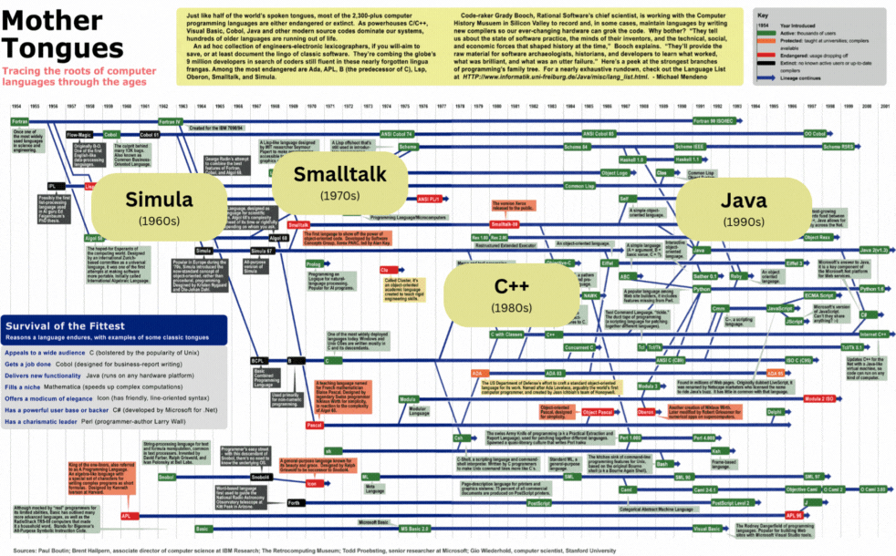
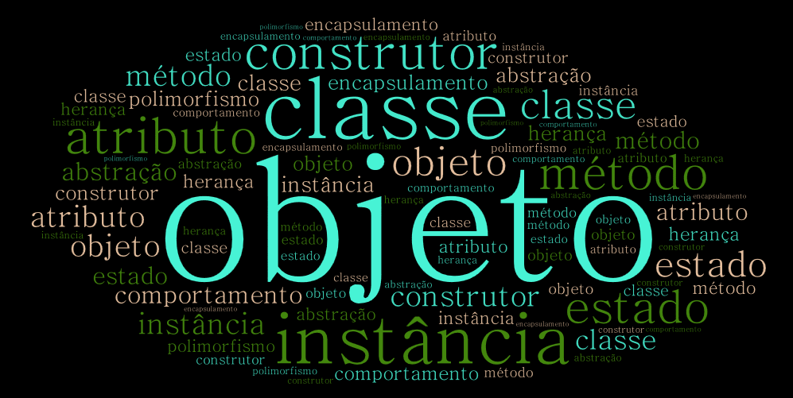

<!--
author:   Andrea Charão

email:    andrea@inf.ufsm.br

version:  0.0.1

language: PT-BR

narrator: Brazilian Portuguese Female

comment:  Material de apoio para a disciplina
          ELC117 - Paradigmas de Programação
          da Universidade Federal de Santa Maria

translation: English  translations/English.md

link:     https://cdn.jsdelivr.net/chartist.js/latest/chartist.min.css

script:   https://cdn.jsdelivr.net/chartist.js/latest/chartist.min.js

@onload
window.CodeRunner = {
    ws: undefined,
    handler: {},
    connected: false,
    error: "",
    url: "",
    firstConnection: true,

    init(url, step = 0) {
        this.url = url
        if (step  >= 10) {
           console.warn("could not establish connection")
           this.error = "could not establish connection to => " + url
           return
        }

        this.ws = new WebSocket(url);

        const self = this
        
        const connectionTimeout = setTimeout(() => {
          self.ws.close();
          console.log("WebSocket connection timed out");
        }, 5000);
        
        
        this.ws.onopen = function () {
            clearTimeout(connectionTimeout);
            self.log("connections established");

            self.connected = true
            
            setInterval(function() {
                self.ws.send("ping")
            }, 15000);
        }
        this.ws.onmessage = function (e) {
            // e.data contains received string.

            let data
            try {
                data = JSON.parse(e.data)
            } catch (e) {
                self.warn("received message could not be handled =>", e.data)
            }
            if (data) {
                self.handler[data.uid](data)
            }
        }
        this.ws.onclose = function () {
            clearTimeout(connectionTimeout);
            self.connected = false
            self.warn("connection closed ... reconnecting")

            setTimeout(function(){
                console.warn("....", step+1)
                self.init(url, step+1)
            }, 1000)
        }
        this.ws.onerror = function (e) {
            clearTimeout(connectionTimeout);
            self.warn("an error has occurred")
        }
    },
    log(...args) {
        window.console.log("CodeRunner:", ...args)
    },
    warn(...args) {
        window.console.warn("CodeRunner:", ...args)
    },
    handle(uid, callback) {
        this.handler[uid] = callback
    },
    send(uid, message, sender=null, restart=false) {
        const self = this
        if (this.connected) {
          message.uid = uid
          this.ws.send(JSON.stringify(message))
        } else if (this.error) {

          if(restart) {
            sender.lia("LIA: terminal")
            this.error = ""
            this.init(this.url)
            setTimeout(function() {
              self.send(uid, message, sender, false)
            }, 2000)

          } else {
            //sender.lia("LIA: wait")
            setTimeout(() => {
              sender.lia(" " + this.error)
              sender.lia(" Maybe reloading fixes the problem ...")
              sender.lia("LIA: stop")
            }, 800)
          }
        } else {
          setTimeout(function() {
            self.send(uid, message, sender, false)
          }, 2000)
          
          if (sender) {
            
            sender.lia("LIA: terminal")
            if (this.firstConnection) {
              this.firstConnection = false
              setTimeout(() => { 
                sender.log("stream", "", [" Waking up execution server ...\n", "This may take up to 30 seconds ...\n", "Please be patient ...\n"])
              }, 100)
            } else {
              sender.log("stream", "", ".")
            }
            sender.lia("LIA: terminal")
          }
        }
    }
}

//window.CodeRunner.init("wss://coderunner.informatik.tu-freiberg.de/")
//window.CodeRunner.init("ws://localhost:4000/")
window.CodeRunner.init("wss://ancient-hollows-41316.herokuapp.com/")
@end

@LIA.java:              @LIA.eval(`["@0.java"]`, `javac @0.java`, `java @0`)
@LIA.c:                 @LIA.eval(`["main.c"]`, `gcc -Wall main.c -o a.out`, `./a.out`)

@LIA.eval:  @LIA.eval_(false,`@0`,@1,@2,@3)

@LIA.evalWithDebug: @LIA.eval_(true,`@0`,@1,@2,@3)

@LIA.eval_
<script>
function random(len=16) {
    let chars = 'ABCDEFGHIJKLMNOPQRSTUVWXYZabcdefghijklmnopqrstuvwxyz0123456789';
    let str = '';
    for (let i = 0; i < len; i++) {
        str += chars.charAt(Math.floor(Math.random() * chars.length));
    }
    return str;
}


const uid = random()
var order = @1
var files = []

var pattern = "@4".trim()

if (pattern.startsWith("\`")){
  pattern = pattern.slice(1,-1)
} else if (pattern.length === 2 && pattern[0] === "@") {
  pattern = null
}

if (order[0])
  files.push([order[0], `@'input(0)`])
if (order[1])
  files.push([order[1], `@'input(1)`])
if (order[2])
  files.push([order[2], `@'input(2)`])
if (order[3])
  files.push([order[3], `@'input(3)`])
if (order[4])
  files.push([order[4], `@'input(4)`])
if (order[5])
  files.push([order[5], `@'input(5)`])
if (order[6])
  files.push([order[6], `@'input(6)`])
if (order[7])
  files.push([order[7], `@'input(7)`])
if (order[8])
  files.push([order[8], `@'input(8)`])
if (order[9])
  files.push([order[9], `@'input(9)`])


send.handle("input", (e) => {
    CodeRunner.send(uid, {stdin: e}, send)
})
send.handle("stop",  (e) => {
    CodeRunner.send(uid, {stop: true}, send)
});


CodeRunner.handle(uid, function (msg) {
    switch (msg.service) {
        case 'data': {
            if (msg.ok) {
                CodeRunner.send(uid, {compile: @2}, send)
            }
            else {
                send.lia("LIA: stop")
            }
            break;
        }
        case 'compile': {
            if (msg.ok) {
                if (msg.message) {
                    if (msg.problems.length)
                        console.warn(msg.message);
                    else
                        console.log(msg.message);
                }

                send.lia("LIA: terminal")
                CodeRunner.send(uid, {exec: @3, filter: pattern})

                if(!@0) {
                  console.clear()
                }
            } else {
                send.lia(msg.message, msg.problems, false)
                send.lia("LIA: stop")
            }
            break;
        }
        case 'stdout': {
            if (msg.ok)
                console.stream(msg.data)
            else
                console.error(msg.data);
            break;
        }

        case 'stop': {
            if (msg.error) {
                console.error(msg.error);
            }

            if (msg.images) {
                for(let i = 0; i < msg.images.length; i++) {
                    console.html("<hr/>", msg.images[i].file)
                    console.html("")
                }
            }

            if (msg.videos) {
                for(let i = 0; i < msg.videos.length; i++) {
                    console.html("<hr/>", msg.videos[i].file)
                    console.html("<video controls style='width:100%' title='" + msg.videos[i].file + "' src='" + msg.videos[i].data + "'></video>")
                }
            }

            if (msg.files) {
                let str = "<hr/>"
                for(let i = 0; i < msg.files.length; i++) {
                    str += `<a href='data:application/octet-stream${msg.files[i].data}' download="${msg.files[i].file}">${msg.files[i].file}</a> `
                }

                console.html(str)
            }

            window.console.warn(msg)

            send.lia("LIA: stop")
            break;
        }

        default:
            console.log(msg)
            break;
    }
})


CodeRunner.send(
    uid, { "data": files }, send, true
);

"LIA: wait"
</script>
@end

-->

<!--
nvm use v14.21.1
liascript-devserver --input README.md --port 3001 --live
-->


[](https://liascript.github.io/course/?https://raw.githubusercontent.com/AndreaInfUFSM/elc117-2024b/main/classes/18/README.md)

# Programação Orientada a Objetos (1)


> Este material é parte de uma introdução ao paradigma de **programação orientada a objetos** em linguagem Java.


## Histórico e motivações


- Origens: linguagens Simula (1960s) e Smalltalk (1970s)
- Programação imperativa, evolução da programação procedimental estruturada 
- Conjunto de conceitos/recursos de programação para lidar com a complexidade crescente dos programas

  - Reuso de código: evitar redundância, aproveitar soluções já desenvolvidas
  - Organização do código: código organizado para melhor compreensão / manutenção



## Procedural X OO

Vídeo: https://www.bbc.co.uk/bitesize/guides/zc8pjty/video

Contraste entre programação procedural e programação orientada a objetos:

| Procedural      | Orientado a objetos  |
|-----------------|-----------------|
| código organizado em subprogramas (módulos, procedimentos, funções)   | código organizado para representar estado e comportamento de objetos |
| dados entram/saem dos subprogramas   | objetos interagem (um chama outro, um se relaciona com outro, etc.)   |


## Terminologia

- A programação orientada a objetos compreende uma vasta terminologia técnica
- Alguns termos para você ir se acostumando: classe, objeto, instância, construtor, atributo e método, estado e comportamento, abstração, encapsulamento, herança, polimorfismo



Criado com: http://wordart.com

## Linguagens

- Muitas linguagens relevantes atualmente possuem suporte a orientação a objetos
- Por exemplo: Java, C++, C#, Python, JavaScript, Swift, Kotlin, Dart, PHP, ...
- Veja alguns rankings de linguagens

  - TIOBE Index

    - Critério: search engines
    - https://www.tiobe.com/tiobe-index/

  - RedMonk

    - Critério: GitHub + StackOverflow 
    - https://redmonk.com/

  - Most Popular Programming Languages 1965 - 2022

    - Compilação de várias fontes em um gráfico animado
    - https://www.youtube.com/watch?v=qQXXI5QFUfw


## Java

- Linguagem criada em 1995 (Sun Microsystems, James Gosling)
- Implementação híbrida: compilador + interpretador (JVM)
- Multiparadigma, mas principalmente orientada a objetos
- Faz parte da família de linguagens derivadas do C
- Histórico de versões: https://en.wikipedia.org/wiki/Java_version_history


### Ambiente de desenvolvimento e execução

- Java Development Kit (JDK): compilador, interpretador e bibliotecas
- Java Runtime Environment (JRE): apenas para execução
- Várias implementações: Oracle, OpenJDK, Azul, etc.
- Gerenciadores de projetos/dependências: Maven, Gradle, etc.
- Em nuvem: Codespaces, Repl.it e muitos outros


### Exemplo clássico

> IDEs escondem compilação e execução em um único botão/atalho, mas entenda isso por partes!


 <details>
  <summary>Hello, World é um bom exemplo?</summary>
  <p>O clássico "Hello, World!" não é um bom exemplo de OOP, pois o paradigma se aplica melhor a programas maiores. Mesmo assim, vale o exemplo como programa mínimo em Java.</p>
</details> 


``` java
class HelloWorld {
  public static void main(String[] args) {
    System.out.println("Hello, World!"); 
  }
}
```
@LIA.java(HelloWorld)

Compilar:

```
javac HelloWorld.java
```

Executar (JVM):

```
java HelloWorld
```


## Atividade de compreensão de código

Esta atividade será realizada em aula, seguindo orientações da professora, usando os seguintes códigos:

- [java01/StudentGrades.java](src/java01/StudentGrades.java)
- [java01/GenerateStudentData.java](src/java01/GenerateStudentData.java)


### StudentGrades.java


Em [java01/StudentGrades.java](src/java01/StudentGrades.java) com o arquivo [students.csv](src/java01/students.csv):

1. Identifique 3 (ou mais) **semelhanças** entre Java e C presentes no código.
2. Identifique 3 (ou mais) **diferenças** entre Java e C presentes no código.
3. O que fazem os comandos `javac StudentGrades.java` e `java StudentGrades`?
4. O que significa `students.size()`? Qual seu valor?
5. Como saber qual a nota retornada por `student.getGrade()`?
6. O que significa `students.add(student)`?
7. O que significa `new Student(name, id, grade)`?
8. O que significa `line.split(",")`?
9. O código manipula dados de estudantes da turma. Que dados caracterizam cada estudante?
10. Identifique um tipo de objeto definido no código.
11. Identifique a criação de um objeto no código.
12. Em Java, strings são objetos da classe String. Identifique no código algumas operações que podemos fazer com strings.
13. O que significa `private` em alguns pontos do código?
14. O que significa `public` em alguns pontos do código?
15. Substitua `student.getGrade()` por `student.grade`. Explique o que acontece na compilação do código.
16. Se trocarmos o nome da classe `StudentGrades` por `Main`, teremos erro de compilação. O que fazer para trocar o nome e não ter erro de compilação?

### GenerateStudentData.java

Em [java01/GenerateStudentData.java](src/java01/GenerateStudentData.java):

1. Identifique 3 (ou mais) **semelhanças** entre Java e C presentes no código.
2. Identifique 3 (ou mais) **diferenças** entre Java e C presentes no código.
3. O que fazem os comandos `javac GenerateStudentData.java` e `java GenerateStudentData`?
4. O que significa `Random random = new Random()`?
5. O que faz o código `random.nextDouble()`?
6. Encontre 2 linhas no código onde é feita a criação de algum objeto.
7. O que significa `try` dentro de `fetchJson`?
8. O que significa `new Student(name, id, grade)`?
9. Onde é especificada a quantidade de estudantes a serem gerados?
10. Em Java, strings são objetos da classe String. Identifique no código algumas operações que podemos fazer com strings.
11. O que significa `private` em alguns pontos do código?
12. O que significa `public` em alguns pontos do código?
13. Como este programa se comporta sem acesso à internet?


## Bibliografia


Robert Sebesta. Conceitos de Linguagens de Programação. Bookman, 2018. Disponível no Portal de E-books da UFSM: http://portal.ufsm.br/biblioteca/leitor/minhaBiblioteca.html (Capítulos 11 e 12)
