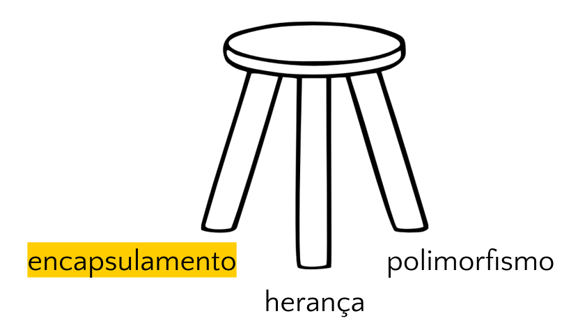
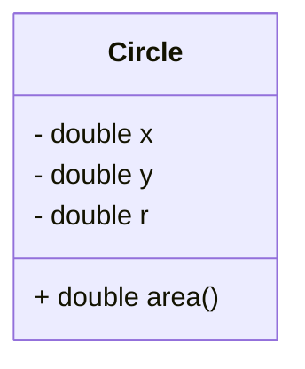

<!--
author:   Andrea Charão

email:    andrea@inf.ufsm.br

version:  0.0.1

language: PT-BR

narrator: Brazilian Portuguese Female

comment:  Material de apoio para a disciplina
          ELC117 - Paradigmas de Programação
          da Universidade Federal de Santa Maria

translation: English  translations/English.md

script:   https://cdn.jsdelivr.net/npm/mermaid@10.5.0/dist/mermaid.min.js


@onload
mermaid.initialize({ startOnLoad: false });
window.CodeRunner = {
    ws: undefined,
    handler: {},
    connected: false,
    error: "",
    url: "",
    firstConnection: true,

    init(url, step = 0) {
        this.url = url
        if (step  >= 10) {
           console.warn("could not establish connection")
           this.error = "could not establish connection to => " + url
           return
        }

        this.ws = new WebSocket(url);

        const self = this
        
        const connectionTimeout = setTimeout(() => {
          self.ws.close();
          console.log("WebSocket connection timed out");
        }, 5000);
        
        
        this.ws.onopen = function () {
            clearTimeout(connectionTimeout);
            self.log("connections established");

            self.connected = true
            
            setInterval(function() {
                self.ws.send("ping")
            }, 15000);
        }
        this.ws.onmessage = function (e) {
            // e.data contains received string.

            let data
            try {
                data = JSON.parse(e.data)
            } catch (e) {
                self.warn("received message could not be handled =>", e.data)
            }
            if (data) {
                self.handler[data.uid](data)
            }
        }
        this.ws.onclose = function () {
            clearTimeout(connectionTimeout);
            self.connected = false
            self.warn("connection closed ... reconnecting")

            setTimeout(function(){
                console.warn("....", step+1)
                self.init(url, step+1)
            }, 1000)
        }
        this.ws.onerror = function (e) {
            clearTimeout(connectionTimeout);
            self.warn("an error has occurred")
        }
    },
    log(...args) {
        window.console.log("CodeRunner:", ...args)
    },
    warn(...args) {
        window.console.warn("CodeRunner:", ...args)
    },
    handle(uid, callback) {
        this.handler[uid] = callback
    },
    send(uid, message, sender=null, restart=false) {
        const self = this
        if (this.connected) {
          message.uid = uid
          this.ws.send(JSON.stringify(message))
        } else if (this.error) {

          if(restart) {
            sender.lia("LIA: terminal")
            this.error = ""
            this.init(this.url)
            setTimeout(function() {
              self.send(uid, message, sender, false)
            }, 2000)

          } else {
            //sender.lia("LIA: wait")
            setTimeout(() => {
              sender.lia(" " + this.error)
              sender.lia(" Maybe reloading fixes the problem ...")
              sender.lia("LIA: stop")
            }, 800)
          }
        } else {
          setTimeout(function() {
            self.send(uid, message, sender, false)
          }, 2000)
          
          if (sender) {
            
            sender.lia("LIA: terminal")
            if (this.firstConnection) {
              this.firstConnection = false
              setTimeout(() => { 
                sender.log("stream", "", [" Waking up execution server ...\n", "This may take up to 30 seconds ...\n", "Please be patient ...\n"])
              }, 100)
            } else {
              sender.log("stream", "", ".")
            }
            sender.lia("LIA: terminal")
          }
        }
    }
}

//window.CodeRunner.init("wss://coderunner.informatik.tu-freiberg.de/")
//window.CodeRunner.init("ws://localhost:4000/")
window.CodeRunner.init("wss://ancient-hollows-41316.herokuapp.com/")
@end


@LIA.java:              @LIA.eval(`["@0.java"]`, `javac @0.java`, `java @0`)
@LIA.c:                 @LIA.eval(`["main.c"]`, `gcc -Wall main.c -o a.out`, `./a.out`)

@LIA.eval:  @LIA.eval_(false,`@0`,@1,@2,@3)

@LIA.evalWithDebug: @LIA.eval_(true,`@0`,@1,@2,@3)


@mermaid: @mermaid_(@uid,```@0```)

@mermaid_
<script run-once="true" modify="false" style="display:block; background: white">
async function draw () {
    const graphDefinition = `@1`;
    const { svg } = await mermaid.render('graphDiv_@0', graphDefinition);
    send.lia("HTML: "+svg);
    send.lia("LIA: stop")
};

draw()
"LIA: wait"
</script>
@end

@mermaid_eval: @mermaid_eval_(@uid)

@mermaid_eval_
<script>
async function draw () {
    const graphDefinition = `@input`;
    const { svg } = await mermaid.render('graphDiv_@0', graphDefinition);
    console.html(svg);
    send.lia("LIA: stop")
};

draw()
"LIA: wait"
</script>
@end

@LIA.eval_
<script>
function random(len=16) {
    let chars = 'ABCDEFGHIJKLMNOPQRSTUVWXYZabcdefghijklmnopqrstuvwxyz0123456789';
    let str = '';
    for (let i = 0; i < len; i++) {
        str += chars.charAt(Math.floor(Math.random() * chars.length));
    }
    return str;
}


const uid = random()
var order = @1
var files = []

var pattern = "@4".trim()

if (pattern.startsWith("\`")){
  pattern = pattern.slice(1,-1)
} else if (pattern.length === 2 && pattern[0] === "@") {
  pattern = null
}

if (order[0])
  files.push([order[0], `@'input(0)`])
if (order[1])
  files.push([order[1], `@'input(1)`])
if (order[2])
  files.push([order[2], `@'input(2)`])
if (order[3])
  files.push([order[3], `@'input(3)`])
if (order[4])
  files.push([order[4], `@'input(4)`])
if (order[5])
  files.push([order[5], `@'input(5)`])
if (order[6])
  files.push([order[6], `@'input(6)`])
if (order[7])
  files.push([order[7], `@'input(7)`])
if (order[8])
  files.push([order[8], `@'input(8)`])
if (order[9])
  files.push([order[9], `@'input(9)`])


send.handle("input", (e) => {
    CodeRunner.send(uid, {stdin: e}, send)
})
send.handle("stop",  (e) => {
    CodeRunner.send(uid, {stop: true}, send)
});


CodeRunner.handle(uid, function (msg) {
    switch (msg.service) {
        case 'data': {
            if (msg.ok) {
                CodeRunner.send(uid, {compile: @2}, send)
            }
            else {
                send.lia("LIA: stop")
            }
            break;
        }
        case 'compile': {
            if (msg.ok) {
                if (msg.message) {
                    if (msg.problems.length)
                        console.warn(msg.message);
                    else
                        console.log(msg.message);
                }

                send.lia("LIA: terminal")
                CodeRunner.send(uid, {exec: @3, filter: pattern})

                if(!@0) {
                  console.clear()
                }
            } else {
                send.lia(msg.message, msg.problems, false)
                send.lia("LIA: stop")
            }
            break;
        }
        case 'stdout': {
            if (msg.ok)
                console.stream(msg.data)
            else
                console.error(msg.data);
            break;
        }

        case 'stop': {
            if (msg.error) {
                console.error(msg.error);
            }

            if (msg.images) {
                for(let i = 0; i < msg.images.length; i++) {
                    console.html("<hr/>", msg.images[i].file)
                    console.html("")
                }
            }

            if (msg.videos) {
                for(let i = 0; i < msg.videos.length; i++) {
                    console.html("<hr/>", msg.videos[i].file)
                    console.html("<video controls style='width:100%' title='" + msg.videos[i].file + "' src='" + msg.videos[i].data + "'></video>")
                }
            }

            if (msg.files) {
                let str = "<hr/>"
                for(let i = 0; i < msg.files.length; i++) {
                    str += `<a href='data:application/octet-stream${msg.files[i].data}' download="${msg.files[i].file}">${msg.files[i].file}</a> `
                }

                console.html(str)
            }

            window.console.warn(msg)

            send.lia("LIA: stop")
            break;
        }

        default:
            console.log(msg)
            break;
    }
})


CodeRunner.send(
    uid, { "data": files }, send, true
);

"LIA: wait"
</script>
@end

-->

<!--
nvm use v14.21.1
liascript-devserver --input README.md --port 3001 --live
-->


[](https://liascript.github.io/course/?https://raw.githubusercontent.com/AndreaInfUFSM/elc117-2025b/main/classes/19/README.md)


# Programação Orientada a Objetos (2)


> Este material faz parte de uma introdução ao paradigma de **programação orientada a objetos** em linguagem Java.


## Conceitos da POO



A programação orientada a objetos se baseia em alguns conceitos (independentes de sintaxe) que favorecem organização, manutenção, compreensão e reuso de código. 

Conceitos básicos:

- Encapsulamento: https://en.wikipedia.org/wiki/Encapsulation_%28computer_programming%29

- Herança: https://en.wikipedia.org/wiki/Inheritance_%28object-oriented_programming%29

- Polimorfismo: https://en.wikipedia.org/wiki/Polymorphism_%28computer_science%29


## Encapsulamento

**Encapsulamento** é a junção de dados (variáveis/propriedades/atributos/estado) e operações (funções/métodos/comportamento) em uma mesma unidade, com proteção/limitação de acesso. 


Fonte: http://www.c-sharpcorner.com

Por quê?

- Organizar código de forma consistente (reunir dados e operações relacionados favorece manutenção, compreensão)
- Oferecer interface para (re)uso independente de detalhes internos (detalhes não são expostos desnecessariamente)

### Classe

- Recurso de linguagem que implementa um encapsulamento
- Geralmente representa a definição de um novo "tipo" 
- É um "molde" para criação de objetos (especifica o que é comum a todos objetos da classe)

Exemplo em Java:

``` java
class Circle {
  private double x; // atributo
  private double y; // atributo
  private double r; // atributo
  public double area() { // método
     return 3.1416 * r * r;
  }
}
```

Onde:

- `x`, `y`, `z` são atributos
- `area()` é um método 
- qualquer `Circle` criado terá seus próprios valores para os atributos `x,y,z`
- dado um `Circle` designado por `c` (ou outro nome qualquer), podemos obter sua área chamando `c.area()`


#### Representação em UML

Unified Modeling Language (UML): https://en.wikipedia.org/wiki/Unified_Modeling_Language




#### Exemplo: C versus Java

Tipo abstrado de dado (TAD) em C (possivelmente em arquivos diferentes):

``` c
typedef struct {
  double x;
  double y;
  double r;
} Circle;

double area(Circle *c) {
  return 3.1416 * c->r * c->r;
}
```

Classe em Java

``` java
class Circle {
  private double x;
  private double y;
  private double r;
  public double area() {
    return 3.1416 * r * r;
  }
}
```
@LIA.java(Circle)


### Objeto


- Um **objeto** é uma instância (um uso) de uma classe
- É criado/alocado em memória e referenciado por um nome


Exemplo em Java:

``` java
class Circle {
  private double x;
  private double y;
  private double r;
  public double area() {
    return 3.1416 * r * r;
  }
}

class TestCircle {
  public static void main(String[] args) {
    // declara a variável c como referência para um objeto da classe Circle
    Circle c;
    // cria objeto da classe Circle e guarda referência em c
    c = new Circle(); 
    // chama método area() do objeto referenciado por c
    System.out.println(c.area());
    // forma abreviada:
    // Circle c1 = new Circle(); 
  }
}
```
@LIA.java(TestCircle)

Onde:

- `c` é um nome de variável que referencia um objeto da classe `Circle`
- ou simplesmente: `c` é uma referência para um objeto `Circle` 
- `c` pode ser `null` - não referencia nenhum objeto
- criamos objetos com `new` (alocação de memória e inicializações)


#### Exemplo: C versus Java

Avance para ver diferenças/semelhanças em:

1. Definição do tipo `Circle`
2. Criação de um `Circle`
3. Uso de um `Circle`


#### Definição do tipo `Circle`


Em C (possivelmente em arquivos diferentes):

``` c
typedef struct {
  double x;
  double y;
  double r;
} Circle;

double area(Circle *c) {
  return 3.1416 * c->r * c->r;
}
```

Em Java: 

``` java
class Circle {
  private double x;
  private double y;
  private double r;
  public double area() {
    return 3.1416 * r * r;
  }
}
```


#### Criação de um `Circle`

Em C (dentro de `main`, por exemplo): : 

``` c
// c é ponteiro para Circle
Circle* c;

// memória alocada para Circle
c = (Circle*) malloc(sizeof(Circle));
```

Em Java (dentro de `main`, por exemplo): : 

``` java
// c é referência para
// objeto da classe Circle
Circle c;

// objeto criado com new
c = new Circle();
```


#### Uso de `Circle`

Em C (dentro de `main`, por exemplo): 

``` c
Circle c1;
area(&c1);

Circle* c2 = (Circle*) malloc(sizeof(Circle));
area(c2);

```

Em Java (dentro de `main`, por exemplo): 

``` java
Circle c = new Circle();

c.area();
```


### Construtores

Um **construtor** é um código que:

- inicializa um objeto
- é chamado na criação do objeto

#### Como? 

Sintaxe em Java:

- Mesmo nome da classe
- Sem tipo de retorno
- Podem existir vários construtores, diferenciados pelos tipos dos argumentos

Exemplo de classe com construtor:

``` java
class Circle {
  private double x, y, r;

  // construtor default, sem argumentos
  public Circle() {
    x = y = 0.0;
    r = 1.0;
  }

  public double area() {
    return 3.1416 * r * r;
  }
}
```

Construtor chamado na criação do objeto:


``` java
class TestCircle {
  public static void main(String[] args) {
    // construtor chamado aqui
    Circle c = new Circle(); 
    System.out.println(c.area());    
  }
}
```

#### Por quê?

Por que linguagens orientadas a objetos têm construtores?

- Inicializações são muito comuns, por isso merecem ser feitas de forma organizada/padronizada
- Evita que cada código "reinvente a roda" na inicialização de objetos (p.ex. com seus próprios nomes, ou em meio a outras operações)
- Tudo isso reforça motivações da POO: código organizado é mais fácil de modificar, compreender, reusar, etc.


### Referências para objetos

- São semelhantes a "ponteiros" em C
- Para usar objetos em Java, precisamos de referências não `null`, do contrário teremos erro ou `NullPointerException`
- No contexto interno da implementação de uma classe em Java, podemos usar `this` para nos referirmos ao próprio objeto (como em C# ou C++, mas diferente de Python que usa `self`)


``` java
class Circle {
  private double x;
  private double y;
  private double r;
  public Circle() {
    this.x = this.y = 0.0;
    this.r = 1.0;
    // Equivalente a:
    // x = y = 0.0;
    // r = 1.0;
    
  }
  public Circle(double x, double y, double r) {
    this.x = x;
    this.y = y;
    this.r = r;
    // Isto seria ambíguo:
    // x = x;
    // y = y;
    // r = r;    
  }
  public double area() {
     return 3.1416 * r * r;
  }
}
```

### Modificadores de acesso

São palavras-chave (por exemplo `private`, `public`, etc.) que especificam a visibilidade de atributos e métodos dentro/fora da classe (*).

| Visibilidade `private` | Visibilidade `public` |
|----------|----------|
| indica acesso permitido somente em código interno à própria classe   | indica acesso permitido fora da classe  |
| boas práticas: manter atributos privados   | boas práticas: métodos públicos para manipulação  |


Exemplo: Podemos acessar `r` livremente dentro da classe Circle

``` java
class Circle {
  private double x;
  private double y;
  private double r;
  public double area() {
     return 3.1416 * r * r;
  }
}
```

Exemplo: Fora da classe Circle, não podemos acessar `r`

``` java
class TestCircle {
  public static void main(String[] args) {
    Circle c = new Circle();    
    System.out.println(c.area());  // Ok, area() é public
    // c.r = 5; // error: r has private access in Circle
  }
}
```

#### Por quê?

Por que linguagens orientadas a objetos costumam ter modificadores de acesso em atributos/métodos(*)?

- Abstração: esconder detalhes quando não são necessários
- Proteção: reuso deve seguir regras para ser confiável/seguro
- Manutenção: alterações internas não exigem alteração nas classes usuárias


(*) Modificadores também podem se aplicar a uma classe inteira dentro de um pacote.

## Prática

### Circle no Codespaces

- Crie um repositório e um Codespace para as práticas de Java clicando aqui: https://classroom.github.com/a/y_Kxvssa

- Baixe estes arquivos e adicione-os ao seu Codespace:

  - [Circle.java](src/Circle.java)
  - [TestCircle.java](src/TestCircle.java)

- Para compilar:

  ```
  java *.java
  ```

- Para executar:

  ```
  javac TestCircle
  ```

### Circle na libGDX

Explore: classe Circle na biblioteca libGDX para desenvolvimento de games

Código-fonte de Circle da libGDX: https://github.com/libgdx/libgdx/blob/master/gdx/src/com/badlogic/gdx/math/Circle.java

Exemplo de uso da classe Circle: [CircleDemo.java](https://github.com/AndreaInfUFSM/java-libgdx-extended-drop-example/blob/master/CircleDemo/core/src/main/java/com/badlogic/circledemo/CircleDemo.java)

> Quais as semelhanças e diferenças entre Circle na libGDX e Circle nesta aula?

<iframe src="https://andreainfufsm.github.io/gdx/circle/" width="100%" height="50%"  style="border:1px solid black;">
</iframe>
  
### Crie sua classe

<h4>Contexto</h4>

Pense nos aplicativos, sistemas, plataformas que você usa diariamente, por exemplo ao ouvir música, assistir vídeos, comunicar com amigos, reservar almoço no RU, etc. É provável que muitos desses exemplos sejam implementados com programação orientada a objetos! 

Nestes exemplos, você consegue identificar "objetos" de uma mesma "classe"? Que atributos caracterizam essa classe? (características que todos objetos da classe possuem, cada um com seu próprio valor). O que se pode fazer com objetos dessa classe? (métodos get/set, etc.).

<h4>Requisitos</h4>


Para responder a essas questões, você deverá criar uma classe em Java à sua escolha, considerando os seguintes requisitos:

1. A classe deve conter **atributos** de pelo menos 2 tipos diferentes, por exemplo:

   `String, int, double, boolean`, etc.

2. A classe deve conter mais de um **construtor**.

3. A classe deve conter **métodos** com prefixo `get` e `set`, respectivamente para obter e alterar cada atributo.

4. A classe deve conter um **método** que implemente alguma **operação** com um ou mais atributos (por exemplo, um teste de condição, um cálculo, uma operação com strings, etc.).

<h4>Compile e execute</h4>


Coloque seu código em um arquivo .java com o mesmo nome da classe. Por exemplo, se a classe fosse `Circle`, o arquivo seria `Circle.java`. 

Compile seu código no Shell usando `javac`. Por exemplo:  `javac Circle.java`

> Atenção! Certifique-se sempre de compilar o código que for modificado. Na dúvida, delete os arquivos .class anteriores (no Shell: `rm *.class`). É possível automatizar isso com gerenciadores de build, como Maven, Gradle, etc. (veremos mais adiante)

### Teste sua classe

<h4>Requisitos</h4>


Para testar sua classe, você vai criar um programa que:

1. Contenha uma classe com um método `main`, seguindo as convenções do Java (ver exemplos desta aula e da anterior). Nomeie esta classe com o prefixo `Test` seguido do nome da classe criada anteriormente (por exemplo, `TestCircle`).

2. Dentro do `main`, **instancie** pelo menos **2 objetos** da classe que você criou.

3. Para cada objeto criado, chame pelo menos **2 métodos** implementados.

<h4>Compile e execute</h4>


Coloque seu código em arquivo .java com o prefixo `Test` seguido do nome da classe criada. Por exemplo, se a classe fosse `Circle`, o arquivo seria `TestCircle.java`.

Execute seu código no Shell usando a JVM (comando `java`). Por exemplo:  `java TestCircle` (lembre que o comando `java` recebe como argumento um nome de classe que contém o método `main`).


## Bibliografia


Robert Sebesta. Conceitos de Linguagens de Programação. Bookman, 2018. Disponível no Portal de E-books da UFSM: http://portal.ufsm.br/biblioteca/leitor/minhaBiblioteca.html (Capítulos 11 e 12)
