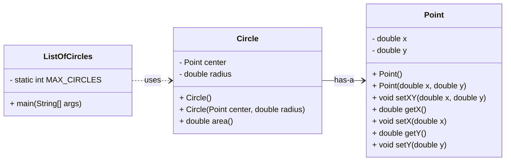
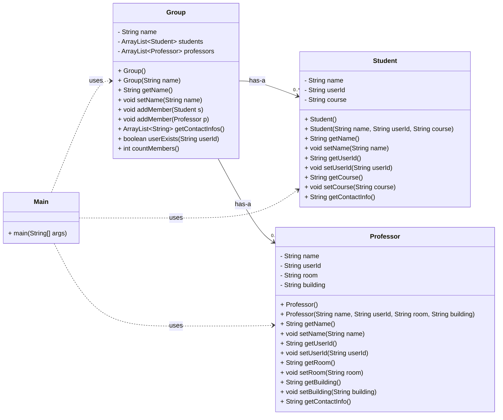

<!--
author:   Andrea Charão

email:    andrea@inf.ufsm.br

version:  0.0.1

language: PT-BR

narrator: Brazilian Portuguese Female

comment:  Material de apoio para a disciplina
          ELC117 - Paradigmas de Programação
          da Universidade Federal de Santa Maria

translation: English  translations/English.md

script:   https://cdn.jsdelivr.net/npm/mermaid@10.5.0/dist/mermaid.min.js


@onload
mermaid.initialize({ startOnLoad: false });
window.CodeRunner = {
    ws: undefined,
    handler: {},
    connected: false,
    error: "",
    url: "",
    firstConnection: true,

    init(url, step = 0) {
        this.url = url
        if (step  >= 10) {
           console.warn("could not establish connection")
           this.error = "could not establish connection to => " + url
           return
        }

        this.ws = new WebSocket(url);

        const self = this
        
        const connectionTimeout = setTimeout(() => {
          self.ws.close();
          console.log("WebSocket connection timed out");
        }, 5000);
        
        
        this.ws.onopen = function () {
            clearTimeout(connectionTimeout);
            self.log("connections established");

            self.connected = true
            
            setInterval(function() {
                self.ws.send("ping")
            }, 15000);
        }
        this.ws.onmessage = function (e) {
            // e.data contains received string.

            let data
            try {
                data = JSON.parse(e.data)
            } catch (e) {
                self.warn("received message could not be handled =>", e.data)
            }
            if (data) {
                self.handler[data.uid](data)
            }
        }
        this.ws.onclose = function () {
            clearTimeout(connectionTimeout);
            self.connected = false
            self.warn("connection closed ... reconnecting")

            setTimeout(function(){
                console.warn("....", step+1)
                self.init(url, step+1)
            }, 1000)
        }
        this.ws.onerror = function (e) {
            clearTimeout(connectionTimeout);
            self.warn("an error has occurred")
        }
    },
    log(...args) {
        window.console.log("CodeRunner:", ...args)
    },
    warn(...args) {
        window.console.warn("CodeRunner:", ...args)
    },
    handle(uid, callback) {
        this.handler[uid] = callback
    },
    send(uid, message, sender=null, restart=false) {
        const self = this
        if (this.connected) {
          message.uid = uid
          this.ws.send(JSON.stringify(message))
        } else if (this.error) {

          if(restart) {
            sender.lia("LIA: terminal")
            this.error = ""
            this.init(this.url)
            setTimeout(function() {
              self.send(uid, message, sender, false)
            }, 2000)

          } else {
            //sender.lia("LIA: wait")
            setTimeout(() => {
              sender.lia(" " + this.error)
              sender.lia(" Maybe reloading fixes the problem ...")
              sender.lia("LIA: stop")
            }, 800)
          }
        } else {
          setTimeout(function() {
            self.send(uid, message, sender, false)
          }, 2000)
          
          if (sender) {
            
            sender.lia("LIA: terminal")
            if (this.firstConnection) {
              this.firstConnection = false
              setTimeout(() => { 
                sender.log("stream", "", [" Waking up execution server ...\n", "This may take up to 30 seconds ...\n", "Please be patient ...\n"])
              }, 100)
            } else {
              sender.log("stream", "", ".")
            }
            sender.lia("LIA: terminal")
          }
        }
    }
}

//window.CodeRunner.init("wss://coderunner.informatik.tu-freiberg.de/")
//window.CodeRunner.init("ws://localhost:4000/")
window.CodeRunner.init("wss://ancient-hollows-41316.herokuapp.com/")
@end


@LIA.java:              @LIA.eval(`["@0.java"]`, `javac @0.java`, `java @0`)
@LIA.c:                 @LIA.eval(`["main.c"]`, `gcc -Wall main.c -o a.out`, `./a.out`)

@LIA.eval:  @LIA.eval_(false,`@0`,@1,@2,@3)

@LIA.evalWithDebug: @LIA.eval_(true,`@0`,@1,@2,@3)


@mermaid: @mermaid_(@uid,```@0```)

@mermaid_
<script run-once="true" modify="false" style="display:block; background: white">
async function draw () {
    const graphDefinition = `@1`;
    const { svg } = await mermaid.render('graphDiv_@0', graphDefinition);
    send.lia("HTML: "+svg);
    send.lia("LIA: stop")
};

draw()
"LIA: wait"
</script>
@end

@mermaid_eval: @mermaid_eval_(@uid)

@mermaid_eval_
<script>
async function draw () {
    const graphDefinition = `@input`;
    const { svg } = await mermaid.render('graphDiv_@0', graphDefinition);
    console.html(svg);
    send.lia("LIA: stop")
};

draw()
"LIA: wait"
</script>
@end

@LIA.eval_
<script>
function random(len=16) {
    let chars = 'ABCDEFGHIJKLMNOPQRSTUVWXYZabcdefghijklmnopqrstuvwxyz0123456789';
    let str = '';
    for (let i = 0; i < len; i++) {
        str += chars.charAt(Math.floor(Math.random() * chars.length));
    }
    return str;
}


const uid = random()
var order = @1
var files = []

var pattern = "@4".trim()

if (pattern.startsWith("\`")){
  pattern = pattern.slice(1,-1)
} else if (pattern.length === 2 && pattern[0] === "@") {
  pattern = null
}

if (order[0])
  files.push([order[0], `@'input(0)`])
if (order[1])
  files.push([order[1], `@'input(1)`])
if (order[2])
  files.push([order[2], `@'input(2)`])
if (order[3])
  files.push([order[3], `@'input(3)`])
if (order[4])
  files.push([order[4], `@'input(4)`])
if (order[5])
  files.push([order[5], `@'input(5)`])
if (order[6])
  files.push([order[6], `@'input(6)`])
if (order[7])
  files.push([order[7], `@'input(7)`])
if (order[8])
  files.push([order[8], `@'input(8)`])
if (order[9])
  files.push([order[9], `@'input(9)`])


send.handle("input", (e) => {
    CodeRunner.send(uid, {stdin: e}, send)
})
send.handle("stop",  (e) => {
    CodeRunner.send(uid, {stop: true}, send)
});


CodeRunner.handle(uid, function (msg) {
    switch (msg.service) {
        case 'data': {
            if (msg.ok) {
                CodeRunner.send(uid, {compile: @2}, send)
            }
            else {
                send.lia("LIA: stop")
            }
            break;
        }
        case 'compile': {
            if (msg.ok) {
                if (msg.message) {
                    if (msg.problems.length)
                        console.warn(msg.message);
                    else
                        console.log(msg.message);
                }

                send.lia("LIA: terminal")
                CodeRunner.send(uid, {exec: @3, filter: pattern})

                if(!@0) {
                  console.clear()
                }
            } else {
                send.lia(msg.message, msg.problems, false)
                send.lia("LIA: stop")
            }
            break;
        }
        case 'stdout': {
            if (msg.ok)
                console.stream(msg.data)
            else
                console.error(msg.data);
            break;
        }

        case 'stop': {
            if (msg.error) {
                console.error(msg.error);
            }

            if (msg.images) {
                for(let i = 0; i < msg.images.length; i++) {
                    console.html("<hr/>", msg.images[i].file)
                    console.html("")
                }
            }

            if (msg.videos) {
                for(let i = 0; i < msg.videos.length; i++) {
                    console.html("<hr/>", msg.videos[i].file)
                    console.html("<video controls style='width:100%' title='" + msg.videos[i].file + "' src='" + msg.videos[i].data + "'></video>")
                }
            }

            if (msg.files) {
                let str = "<hr/>"
                for(let i = 0; i < msg.files.length; i++) {
                    str += `<a href='data:application/octet-stream${msg.files[i].data}' download="${msg.files[i].file}">${msg.files[i].file}</a> `
                }

                console.html(str)
            }

            window.console.warn(msg)

            send.lia("LIA: stop")
            break;
        }

        default:
            console.log(msg)
            break;
    }
})


CodeRunner.send(
    uid, { "data": files }, send, true
);

"LIA: wait"
</script>
@end

-->

<!--
nvm use v14.21.1
liascript-devserver --input README.md --port 3001 --live
-->


[](https://liascript.github.io/course/?https://raw.githubusercontent.com/AndreaInfUFSM/elc117-2025b/main/classes/20/README.md)


# Programação Orientada a Objetos (3)


> Este material faz parte de uma introdução ao paradigma de **programação orientada a objetos** em linguagem Java.


Avance para preparar seu ambiente e ver o enunciado dos exercícios.

## Prepare seu ambiente Java

<h4>Qual Java Development Kit (JDK) usar?</h4>

- Opção 1: Use a distribuição do JDK do GitHub Codespaces. Você pode criar um Codespace clicando neste link: https://classroom.github.com/a/y_Kxvssa

- Opção 2: Instale uma distribuição localmente. Existem muitas distribuições e versões. É recomendável escolher alguma versão LTS (Long Term Support), como JDK 17 ou JDK 21 (a JDK 25 é muito recente).

  - Veja distribuições aqui: https://sdkman.io/jdks
  - Se estiver no Windows: https://learn.microsoft.com/en-us/java/openjdk/download
  - Se estiver em alguma distribuição Linux, use SDKMAN (que também pode ser usado no GitHub Codespaces):
  
    1. Instale SDKMAN pelo terminal: https://sdkman.io/install
    2. Use SDKMAN para installar a JDK: https://sdkman.io/usage


## Obtenha o código desta prática

Os arquivos desta prática estão no repositório da disciplina. Você pode obtê-los de mais de uma forma:

- Opção 1 (preferível): Clonar o repositório da disciplina (localmente ou no Codespace), com o seguinte comando no terminal:

  ```
  git clone https://github.com/andreaInfUFSM/elc117-2025b
  ```

- Opção 2: Baixar o repositório como um único arquivo .zip: https://github.com/AndreaInfUFSM/elc117-2025b/archive/refs/heads/main.zip


> ATENÇÃO: Os arquivos estão em sub-pastas na pasta `elc117-2025b/classes/20/src`


## Parte 1: Point, Circle e ListOfCircles

> Nesta parte, você vai apenas analisar e executar os códigos fornecidos, como base para as partes seguintes. 

Você vai trabalhar com arquivos na pasta `01-circles`. Os arquivos correspondem ao diagrama UML abaixo:





### Código Java

- [Point.java](src/01-circles/Point.java): contém uma classe que representa um ponto em um plano, com coordenadas X e Y
- [Circle.java](src/01-circles/Circle.java): contém uma classe que representa um círculo, definido por um ponto central e um raio
- [ListOfCircles.java](src/01-circles/ListOfCircles.java): contém classe com método `main` que cria vários objetos e os adiciona a uma lista

> ATENÇÃO: Os arquivos estão na pasta `elc117-2025b/classes/20/src/01-circles`


``` java
import java.util.ArrayList;

class Point {
  private double x;
  private double y;

  public Point() {
  }

  public Point(double x, double y) {
    this.x = x;
    this.y = y;
  }

  public void setXY(double x, double y) {
    this.x = x;
    this.y = y;
  }

  public double getX() {
    return this.x;
  }

  public void setX(double x) {
    this.x = x;
  }

  public double getY() {
    return this.y;
  }

  public void setY(double y) {
    this.y = y;
  }
}

class Circle {
  Point center;
  double radius;


  public Circle() {
    this.center = new Point(0,0);
    this.radius = 0;
  }

  public Circle(Point center, double radius) {
    this.center = center;
    this.radius = radius;
  }

  
  public double area() {
    return Math.PI * radius * radius;
  }

}

class ListOfCircles {
  // Constants in Java: https://www.baeldung.com/java-constants-good-practices
  private static final int MAX_CIRCLES = 6;

  public static void main(String[] args) {
    ArrayList<Circle> list = new ArrayList<Circle>();
    
    // Longer version: create a Point, then a Circle, and then add the Circle to the list
    Point p = new Point(1.5, 1.5);
    Circle c = new Circle(p, 3.5);
    list.add(c);

    for (int i = 0; i < MAX_CIRCLES; i++) {
      // Shorter version: create and insert objects in a single line
      list.add(new Circle(new Point(i, i+2), i + 3.5));
    }
    System.out.println("Iterate over the list (C-like, longer code):");    
    for (int i = 0; i < list.size(); i++) {
      System.out.println(list.get(i).area());
    }
  
    System.out.println("Iterate over the list (shorter, for-each syntax, same result):");
    // For each iteration, the variable 'item' will refer to the next object in the list
    for (Circle item : list) {
      System.out.println(item.area());
    }
    
  }
}
```
@LIA.java(ListOfCircles)


### Compile, execute, analise

1. Compile e execute o código na pasta `01-circles` (depois de percorrer as pastas com `cd` até chegar na pasta desejada):


   ```
   cd 01-circles
   javac *.java
   java ListOfCircles
   ```
   

2. Analise as classes `Point` e `Circle`. Note que cada uma delas é uma classe bem simples, como as que vimos na aula anterior.

3. Analise a classe `ListOfCircles`, que contém novidades. Veja que esta classe usa a classe `ArrayList`, que representa uma estrutura de dados muito útil. Para usá-la, temos que primeiro criar um objeto da classe `ArrayList`, e depois usar métodos públicos desta classe para adicionar elementos ou fazer outras operações com a lista. 

4. Veja [aqui](https://www.w3schools.com/java/java_arraylist.asp) algumas operações possíveis de realizar com uma `ArrayList`. 


### Codespaces: comandos Linux

Se estiver usando o Codespaces, aproveite esta prática para exercitar alguns comandos Linux no terminal:


- Para entrar na pasta `elc117-2025b`: `cd elc117-2025b` (dica: use Tab para completar nomes de arquivos/pastas)

- Para ver conteúdo de uma pasta: `ls`

- Para voltar à pasta raiz da sua conta: `cd`

- Para saber em que pasta você está: `pwd`

- Para recuar a uma pasta imediatamente acima: `cd ..`

- Para remover todos os arquivos `.class` em uma pasta: `rm *.class`


## Parte 2: ListOfTeamMates

> Esta parte deve ser realizada na pasta `02-teammates`.

Nesta parte, você vai criar um programa para armazenar informações sobre uma lista de colegas de equipe. 

Os dados a serem armazenados podem ser constantes ou gerados aleatoriamente (não devem ser digitados pelo usuário).

⚠️ Sempre que for definir nomes de classes, métodos, atributos, variáveis, etc., acostume-se a seguir alguma convenção de estilo, por exemplo
https://google.github.io/styleguide/javaguide.html#s5-naming. Veja [aqui](https://vaiprogramar.com/nomes-de-variaveis-tudo-que-voce-precisa-saber-para-programar/) um artigo sobre a importância disso.


### Class TeamMate

Na pasta `02-teammates`, no arquivo `TeamMate.java`:

1. Crie a classe `TeamMate` com os seguintes atributos representando um colega:

   - userId: String
   - name: String
   - online: boolean 

2. Crie métodos get/set para todos os atributos.

3. Crie um construtor default (que não recebe argumentos). Você pode escolher quais serão os valores default para cada atributo.

4. Crie um construtor que receba 3 argumentos e os utilize para inicializar os 3 atributos.

5. Crie um construtor que receba valores para `userId` e `name` e inicialize os 2 atributos correspondentes. Este construtor deverá inicializar o atributo `online` com o valor default `false`.

### Classe ListOfTeamMates

Na pasta `02-teammates`, no arquivo `ListOfTeamMates.java`:

1. Crie a classe `ListOfTeamMates` que deverá ter um método `main`.  Siga exatamente a sintaxe usada nos outros exemplos que definem este método: `public static void main(String[] args)`.

2. Dentro do método `main`, crie um objeto da classe `ArrayList<TeamMate>` para representar uma lista de colegas de equipe.

3. Crie vários objetos da classe `TeamMate`, usando qualquer lógica à sua escolha para setar os atributos de cada `TeamMate`. Adicione todos os objetos na lista.

4. Percorra a lista e mostre o nome de cada `TeamMate` armazenado.

5. Percorra a lista e mostre o `userId` dos `TeamMate` que estiverem `online`.

6. Consulte [aqui](https://www.w3schools.com/java/java_arraylist.asp) outros métodos disponíveis na classe `ArrayList` e utilize algum que não tenha sido usado antes.

### Sandbox (navegador)

Caso esteja sem ambiente de desenvolvimento Java disponível, você pode usar o espaço abaixo para o exercício. 

> ATENÇÃO: O código adicionado será perdido se você recarregar a página.

``` java
import java.util.ArrayList;

class TeamMate {

}

class ListOfTeamMates {


}

```
@LIA.java(ListOfCircles)


## Parte 3: Groups

> Nesta parte, você vai completar um código fornecido.


Você vai trabalhar com arquivos na pasta `03-groups`. Os arquivos são os seguintes:


- [Student.java](src/03-groups/Student.java): classe que representa um estudante de uma instituição
- [Professor.java](src/03-groups/Professor.java): classe que representa um professor de uma instituição
- [Group.java](src/03-groups/Group.java): classe que representa um grupo de pesquisa da instituição. Um grupo pode ter estudantes e professores como membros. **Esta classe está incompleta!**
- [Main.java](src/03-groups/Main.java): classe contendo um método `main` que cria e manipula objetos das classes acima




### Completando o código

1. Compile e execute o código:

   ```
   cd 03-groups
   javac *.java
   java Main
   ```
   **Você verá que a compilação dá erro, pois o código está incompleto!**


2. Você deverá fazer o código funcionar alterando somente o arquivo `Group.java`, de forma a completar as partes marcadas com "COMPLETE-ME". Para isso, é importante analisar todos os arquivos fornecidos.

4. Se o código for completado como solicitado, a saída do Main será a seguinte:

   ```
   NCC has 3 members
   [{class='Student', name='Nome1 Sobrenome1', userId='username1'}, {class='Student', name='Nome2 Sobrenome2', userId='username2'}, {class='Professor', name='Andrea Charao', userId='andrea', room='376', building='Anexo B'}]
   User andrea found
   ```


### Refletindo sobre o código

O código fornecido não usa todo o potencial da orientação a objetos. Vamos fazer uma análise crítica deste código.

1. Você consegue identificar alguma redundância nos códigos (dentro de uma mesma classe ou em classes diferentes)?

2. O que aconteceria se fosse necessário armazenar outros atributos sobre estudantes e professores? (por exemplo, CPF, data de nascimento, telefone, etc?)

3. O que aconteceria na classe `Group` se tivéssemos outras categorias de membros além de estudantes e professores (técnicos, administradores, etc.)?


## Bibliografia


Robert Sebesta. Conceitos de Linguagens de Programação. Bookman, 2018. Disponível no Portal de E-books da UFSM: http://portal.ufsm.br/biblioteca/leitor/minhaBiblioteca.html (Capítulos 11 e 12)
