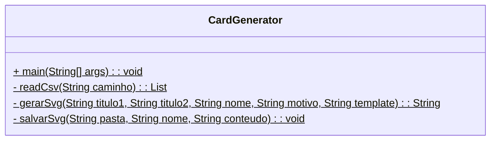
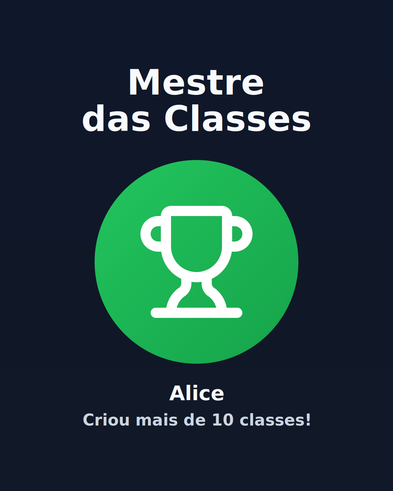
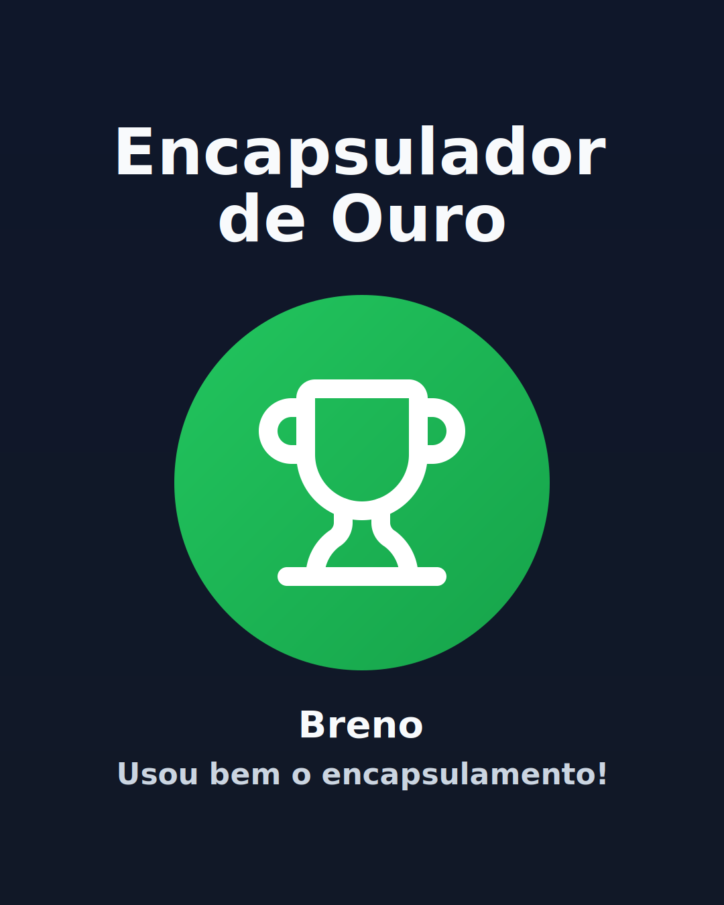
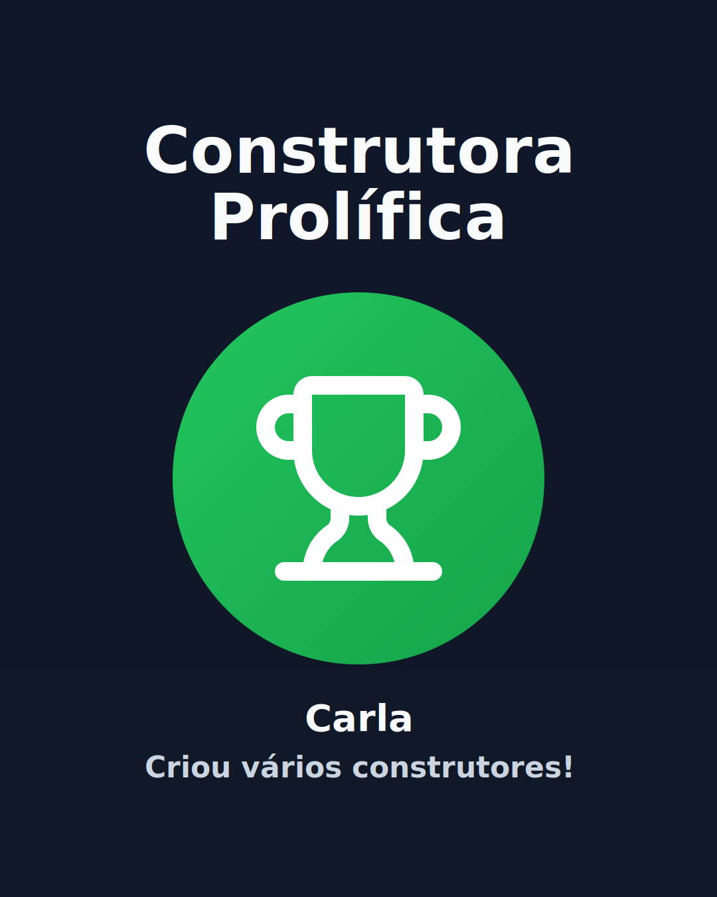
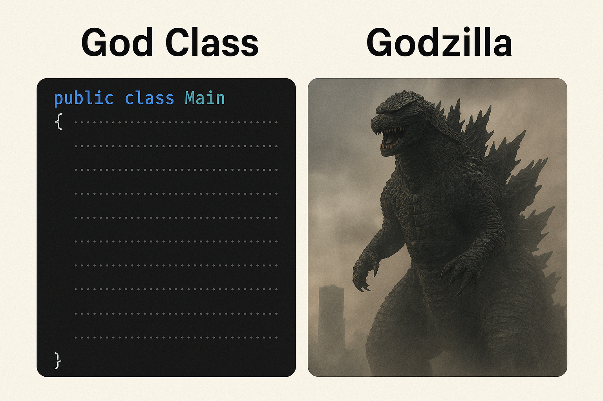
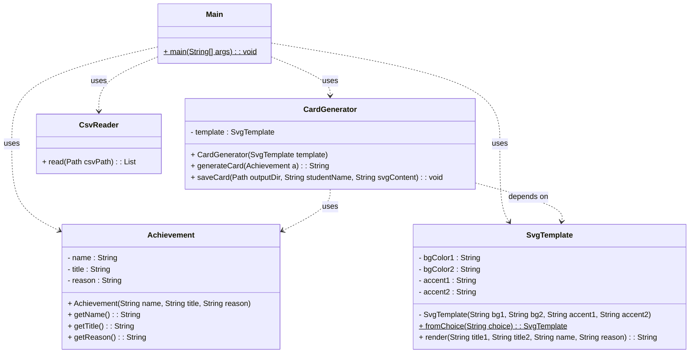

<!--
author:   Andrea Charão

email:    andrea@inf.ufsm.br

version:  0.0.1

language: PT-BR

narrator: Brazilian Portuguese Female

comment:  Material de apoio para a disciplina
          ELC117 - Paradigmas de Programação
          da Universidade Federal de Santa Maria

translation: English  translations/English.md

script:   https://cdn.jsdelivr.net/npm/mermaid@10.5.0/dist/mermaid.min.js


@onload
mermaid.initialize({ startOnLoad: false });
window.CodeRunner = {
    ws: undefined,
    handler: {},
    connected: false,
    error: "",
    url: "",
    firstConnection: true,

    init(url, step = 0) {
        this.url = url
        if (step  >= 10) {
           console.warn("could not establish connection")
           this.error = "could not establish connection to => " + url
           return
        }

        this.ws = new WebSocket(url);

        const self = this
        
        const connectionTimeout = setTimeout(() => {
          self.ws.close();
          console.log("WebSocket connection timed out");
        }, 5000);
        
        
        this.ws.onopen = function () {
            clearTimeout(connectionTimeout);
            self.log("connections established");

            self.connected = true
            
            setInterval(function() {
                self.ws.send("ping")
            }, 15000);
        }
        this.ws.onmessage = function (e) {
            // e.data contains received string.

            let data
            try {
                data = JSON.parse(e.data)
            } catch (e) {
                self.warn("received message could not be handled =>", e.data)
            }
            if (data) {
                self.handler[data.uid](data)
            }
        }
        this.ws.onclose = function () {
            clearTimeout(connectionTimeout);
            self.connected = false
            self.warn("connection closed ... reconnecting")

            setTimeout(function(){
                console.warn("....", step+1)
                self.init(url, step+1)
            }, 1000)
        }
        this.ws.onerror = function (e) {
            clearTimeout(connectionTimeout);
            self.warn("an error has occurred")
        }
    },
    log(...args) {
        window.console.log("CodeRunner:", ...args)
    },
    warn(...args) {
        window.console.warn("CodeRunner:", ...args)
    },
    handle(uid, callback) {
        this.handler[uid] = callback
    },
    send(uid, message, sender=null, restart=false) {
        const self = this
        if (this.connected) {
          message.uid = uid
          this.ws.send(JSON.stringify(message))
        } else if (this.error) {

          if(restart) {
            sender.lia("LIA: terminal")
            this.error = ""
            this.init(this.url)
            setTimeout(function() {
              self.send(uid, message, sender, false)
            }, 2000)

          } else {
            //sender.lia("LIA: wait")
            setTimeout(() => {
              sender.lia(" " + this.error)
              sender.lia(" Maybe reloading fixes the problem ...")
              sender.lia("LIA: stop")
            }, 800)
          }
        } else {
          setTimeout(function() {
            self.send(uid, message, sender, false)
          }, 2000)
          
          if (sender) {
            
            sender.lia("LIA: terminal")
            if (this.firstConnection) {
              this.firstConnection = false
              setTimeout(() => { 
                sender.log("stream", "", [" Waking up execution server ...\n", "This may take up to 30 seconds ...\n", "Please be patient ...\n"])
              }, 100)
            } else {
              sender.log("stream", "", ".")
            }
            sender.lia("LIA: terminal")
          }
        }
    }
}

//window.CodeRunner.init("wss://coderunner.informatik.tu-freiberg.de/")
//window.CodeRunner.init("ws://localhost:4000/")
window.CodeRunner.init("wss://ancient-hollows-41316.herokuapp.com/")
@end


@LIA.java:              @LIA.eval(`["@0.java"]`, `javac @0.java`, `java @0`)
@LIA.c:                 @LIA.eval(`["main.c"]`, `gcc -Wall main.c -o a.out`, `./a.out`)

@LIA.eval:  @LIA.eval_(false,`@0`,@1,@2,@3)

@LIA.evalWithDebug: @LIA.eval_(true,`@0`,@1,@2,@3)


@mermaid: @mermaid_(@uid,```@0```)

@mermaid_
<script run-once="true" modify="false" style="display:block; background: white">
async function draw () {
    const graphDefinition = `@1`;
    const { svg } = await mermaid.render('graphDiv_@0', graphDefinition);
    send.lia("HTML: "+svg);
    send.lia("LIA: stop")
};

draw()
"LIA: wait"
</script>
@end

@mermaid_eval: @mermaid_eval_(@uid)

@mermaid_eval_
<script>
async function draw () {
    const graphDefinition = `@input`;
    const { svg } = await mermaid.render('graphDiv_@0', graphDefinition);
    console.html(svg);
    send.lia("LIA: stop")
};

draw()
"LIA: wait"
</script>
@end

@LIA.eval_
<script>
function random(len=16) {
    let chars = 'ABCDEFGHIJKLMNOPQRSTUVWXYZabcdefghijklmnopqrstuvwxyz0123456789';
    let str = '';
    for (let i = 0; i < len; i++) {
        str += chars.charAt(Math.floor(Math.random() * chars.length));
    }
    return str;
}


const uid = random()
var order = @1
var files = []

var pattern = "@4".trim()

if (pattern.startsWith("\`")){
  pattern = pattern.slice(1,-1)
} else if (pattern.length === 2 && pattern[0] === "@") {
  pattern = null
}

if (order[0])
  files.push([order[0], `@'input(0)`])
if (order[1])
  files.push([order[1], `@'input(1)`])
if (order[2])
  files.push([order[2], `@'input(2)`])
if (order[3])
  files.push([order[3], `@'input(3)`])
if (order[4])
  files.push([order[4], `@'input(4)`])
if (order[5])
  files.push([order[5], `@'input(5)`])
if (order[6])
  files.push([order[6], `@'input(6)`])
if (order[7])
  files.push([order[7], `@'input(7)`])
if (order[8])
  files.push([order[8], `@'input(8)`])
if (order[9])
  files.push([order[9], `@'input(9)`])


send.handle("input", (e) => {
    CodeRunner.send(uid, {stdin: e}, send)
})
send.handle("stop",  (e) => {
    CodeRunner.send(uid, {stop: true}, send)
});


CodeRunner.handle(uid, function (msg) {
    switch (msg.service) {
        case 'data': {
            if (msg.ok) {
                CodeRunner.send(uid, {compile: @2}, send)
            }
            else {
                send.lia("LIA: stop")
            }
            break;
        }
        case 'compile': {
            if (msg.ok) {
                if (msg.message) {
                    if (msg.problems.length)
                        console.warn(msg.message);
                    else
                        console.log(msg.message);
                }

                send.lia("LIA: terminal")
                CodeRunner.send(uid, {exec: @3, filter: pattern})

                if(!@0) {
                  console.clear()
                }
            } else {
                send.lia(msg.message, msg.problems, false)
                send.lia("LIA: stop")
            }
            break;
        }
        case 'stdout': {
            if (msg.ok)
                console.stream(msg.data)
            else
                console.error(msg.data);
            break;
        }

        case 'stop': {
            if (msg.error) {
                console.error(msg.error);
            }

            if (msg.images) {
                for(let i = 0; i < msg.images.length; i++) {
                    console.html("<hr/>", msg.images[i].file)
                    console.html("")
                }
            }

            if (msg.videos) {
                for(let i = 0; i < msg.videos.length; i++) {
                    console.html("<hr/>", msg.videos[i].file)
                    console.html("<video controls style='width:100%' title='" + msg.videos[i].file + "' src='" + msg.videos[i].data + "'></video>")
                }
            }

            if (msg.files) {
                let str = "<hr/>"
                for(let i = 0; i < msg.files.length; i++) {
                    str += `<a href='data:application/octet-stream${msg.files[i].data}' download="${msg.files[i].file}">${msg.files[i].file}</a> `
                }

                console.html(str)
            }

            window.console.warn(msg)

            send.lia("LIA: stop")
            break;
        }

        default:
            console.log(msg)
            break;
    }
})


CodeRunner.send(
    uid, { "data": files }, send, true
);

"LIA: wait"
</script>
@end

-->

<!--
nvm use v14.21.1
liascript-devserver --input README.md --port 3001 --live
-->


[](https://liascript.github.io/course/?https://raw.githubusercontent.com/AndreaInfUFSM/elc117-2025b/main/classes/21/README.md)


# Programação Orientada a Objetos (4)


> Este material faz parte de uma introdução ao paradigma de **programação orientada a objetos** em linguagem Java.


Avance para preparar seu ambiente e ver o enunciado dos exercícios.


## Repositório

Caso ainda não tenha criado um repositório para as práticas de Java, clique aqui: https://classroom.github.com/a/y_Kxvssa


## Obtenha o código desta prática

Os arquivos desta prática estão no repositório da disciplina. Você pode obtê-los de diferentes formas:

- Opção 1 (preferível): Clonar o repositório da disciplina (localmente ou no Codespace), com o seguinte comando no terminal:

  ```
  git clone https://github.com/andreaInfUFSM/elc117-2025b
  ```

- Opção 2: Baixar o repositório como um único arquivo .zip: https://github.com/AndreaInfUFSM/elc117-2025b/archive/refs/heads/main.zip


> ATENÇÃO: Os arquivos estão em sub-pastas na pasta `elc117-2025b/classes/21/src`


## CardGenerator (v1)

> Nesta parte, você vai executar e analisar o código fornecido, como base para as partes seguintes. 

Você vai trabalhar com os arquivos na pasta `v1`. 

### Diagrama de classe

O código em [CardGenerator.java](src/v1/CardGenerator.java) ([github]((https://github.com/AndreaInfUFSM/elc117-2025b/blob/main/classes/21/src/v1/CardGenerator.java))) corresponde ao diagrama UML abaixo:





### Compile e execute


- Compile e execute o código na pasta `v1` (depois de percorrer as pastas com `cd` até chegar na pasta desejada):


  ```
  cd v1
  javac CardGenerator.java
  java CardGenerator
  ```

- Observe os arquivos gerados dentro da pasta `cards`. Por exemplo:

  
  
  
  

- Altere o arquivo `conquistas.csv` e gere novos cards.

- Gere cards com outros templates, passando argumentos na linha de comando:

  ```   
  java CardGenerator azul
  java CardGenerator vermelho
  ```

### Analise as más práticas


- O código em [CardGenerator.java](src/v1/CardGenerator.java) não é bem orientado a objetos e também não segue boas práticas válidas para qualquer paradigma/linguagem de programação. Ainda assim, funciona e contém partes úteis que podem ser reaproveitadas/refatoradas.

- Identifique as más práticas analisando o código e os comentários.

- Nessa linha, saiba mais sobre "God class" ou "God object": (1) [God object na Wikipedia](https://en.wikipedia.org/wiki/God_object), (2) [Clean Code #03 God Object Antipattern - how to fix it?](https://www.youtube.com/watch?v=11vTR7L8zi4)

  


## CardGenerator (v2)

> Esta parte deve ser realizada na pasta `v2`.

Nesta parte, é fornecido um código incompleto, que refatora parte do código anterior, corrigindo alguns problemas e aplicando melhor os recursos de programação orientada a objetos.


### Diagrama de classes

O código em [v2](src/v2/) corresponde ao diagrama UML abaixo:





### Organização do código

```
.
├── conquistas.csv
├── io
│   └── CsvReader.java
├── Main.java
├── model
│   └── Achievement.java
├── service
│   └── CardGenerator.java
└── template
    └── SvgTemplate.java
```

### Complete o código

1. Complete a classe `Achievement` no arquivo [model/Achievement.java](src/v2/model/Achievement.java)

2. Complete o código em `Main` no arquivo [Main.java](src/v2/Main.java), para gerar e salvar cada card, usando métodos definidos em CardGenerator.java


### Compile e execute


- Compile e execute o código na pasta `v2` (depois de percorrer as pastas com `cd` até chegar na pasta desejada):


  ```
  cd v2
  javac -d build Main.java
  java -cp build Main
  ```

- Entenda os comandos:

  - `javac Main.java`: chama o compilador Java, que vai traduzir o Main.java para um ou mais arquivos .class (de acordo com as classes contidas no arquivo). Também vai compilar outros .java que estejam em subpastas e sejam importados pelo Main.java
  - `javac -d build Main.java`: define o diretório/pasta de destino da compilação como sendo `build` (pode ser qualquer nome, a pasta será criada se não existir). Essa pasta conterá todos os .class gerados
  - `java Main`: executa o método `main` da classe `Main` que está na pasta corrente (a classe pode ter qualquer nome)
  - `java -cp build Main`: `-cp` ajusta o classpath para a pasta `build` e executa o método `main` da classe `Main`, que está dentro da pasta `build`. O `classpath` define os locais onde a JVM pode procurar classes

  
- Se o novo programa foi completado corretamente, a execução vai gerar cards nos modelos verde/default ou azul, equivalentes aos da versão anterior.

### Continue

Implemente outras funcionalidades no programa fornecido. Algumas ideias:

- Crie outros templates configuráveis: (a) com outra estrutura no código SVG e/ou (b) variando cores, posições, ícones. 

  - Ícones: na pasta [assets](https://github.com/AndreaInfUFSM/elc117-2025b/tree/main/classes/21/src/assets) estão outros ícones que podem ser incorporados aos cards. Fonte: https://lucide.dev/icons/

- Crie uma lógica de geração dos cards que permita gerar cards diferentes para cada linha de conquistas.csv

  - Por exemplo: escolha baseada em algum atributo textual de Achievement; escolha aleatória de alguns atributos, utilizando classe Random

- Para permitir mais flexibilidade na configuração de templates, crie uma ou mais classes para lidar com **esquemas de cores**. 

  - Um esquema/paleta de cor pode ter combinações de cores escolhidas **manualmente** ou geradas **automaticamente** a partir de regras para cores análogas, complementares, triádicas. Ver: https://pt.wikipedia.org/wiki/C%C3%ADrculo_crom%C3%A1tico

  

- Crie uma lógica para gerar o conteúdo do arquivo conquistas.csv

  - Que tal usar a API web de um modelo de IA como `gemini-2.5-flash`? Dica: aproveite o código de exemplo de uma aula passada, que usa a API de um serviço web.

## Bibliografia


Robert Sebesta. Conceitos de Linguagens de Programação. Bookman, 2018. Disponível no Portal de E-books da UFSM: http://portal.ufsm.br/biblioteca/leitor/minhaBiblioteca.html (Capítulos 11 e 12)
