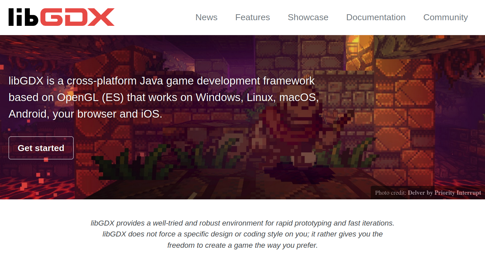
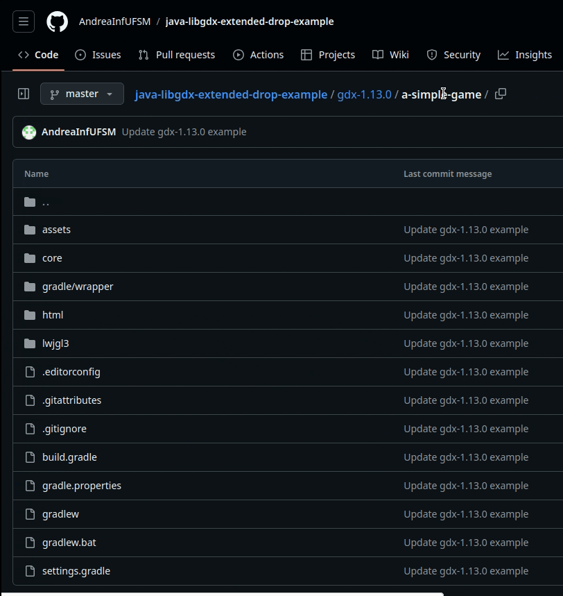
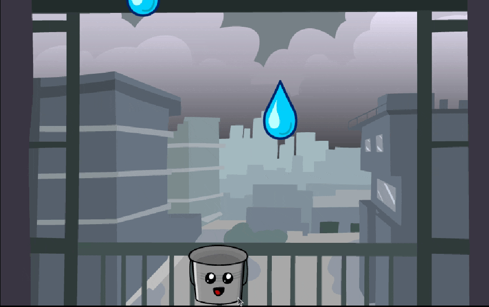
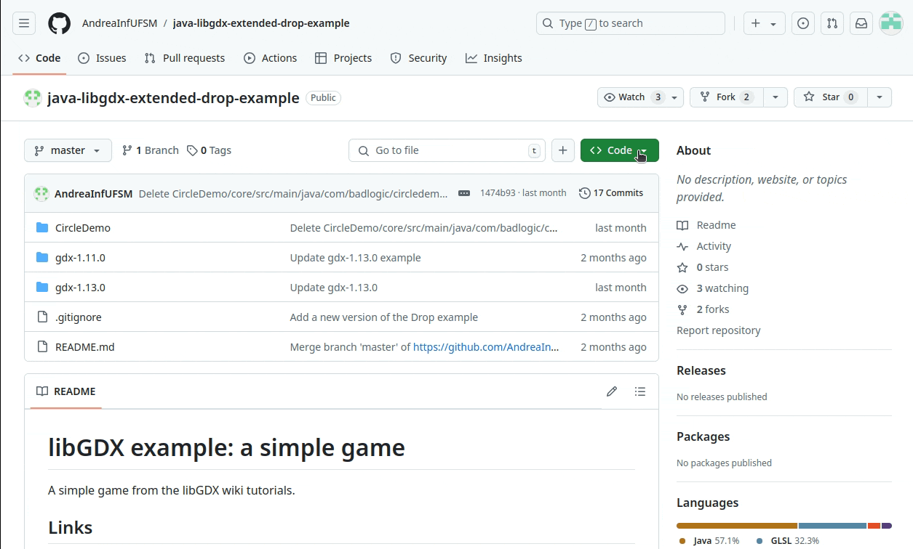
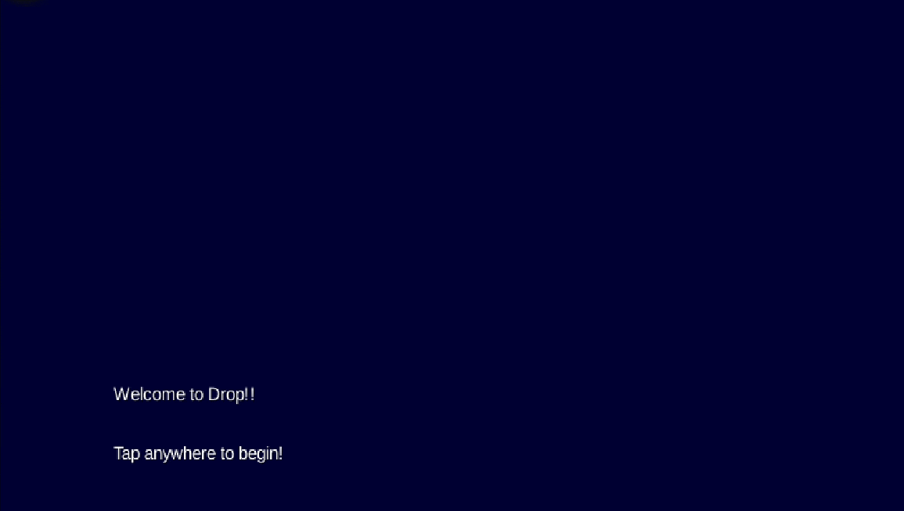

<!--
author:   Andrea Charão

email:    andrea@inf.ufsm.br

version:  0.0.1

language: PT-BR

narrator: Brazilian Portuguese Female

comment:  Material de apoio para a disciplina
          ELC117 - Paradigmas de Programação
          da Universidade Federal de Santa Maria

translation: English  translations/English.md

script:   https://cdn.jsdelivr.net/npm/mermaid@10.5.0/dist/mermaid.min.js

@load.java: @load(java,@0)

@load
<script style="display: block" modify="false" run-once="true">
    fetch("@1")
    .then((response) => {
        if (response.ok) {
            response.text()
            .then((text) => {
                send.lia("LIASCRIPT:\n``` @0\n" + text + "\n```")
            })
        } else {
            send.lia("HTML: <span style='color: red'>Something went wrong, could not load <a href='@1'>@1</a></span>")
        }
    })
    "loading: @1"
</script>
@end

@onload
mermaid.initialize({ startOnLoad: false });
window.CodeRunner = {
    ws: undefined,
    handler: {},
    connected: false,
    error: "",
    url: "",
    firstConnection: true,

    init(url, step = 0) {
        this.url = url
        if (step  >= 10) {
           console.warn("could not establish connection")
           this.error = "could not establish connection to => " + url
           return
        }

        this.ws = new WebSocket(url);

        const self = this
        
        const connectionTimeout = setTimeout(() => {
          self.ws.close();
          console.log("WebSocket connection timed out");
        }, 5000);
        
        
        this.ws.onopen = function () {
            clearTimeout(connectionTimeout);
            self.log("connections established");

            self.connected = true
            
            setInterval(function() {
                self.ws.send("ping")
            }, 15000);
        }
        this.ws.onmessage = function (e) {
            // e.data contains received string.

            let data
            try {
                data = JSON.parse(e.data)
            } catch (e) {
                self.warn("received message could not be handled =>", e.data)
            }
            if (data) {
                self.handler[data.uid](data)
            }
        }
        this.ws.onclose = function () {
            clearTimeout(connectionTimeout);
            self.connected = false
            self.warn("connection closed ... reconnecting")

            setTimeout(function(){
                console.warn("....", step+1)
                self.init(url, step+1)
            }, 1000)
        }
        this.ws.onerror = function (e) {
            clearTimeout(connectionTimeout);
            self.warn("an error has occurred")
        }
    },
    log(...args) {
        window.console.log("CodeRunner:", ...args)
    },
    warn(...args) {
        window.console.warn("CodeRunner:", ...args)
    },
    handle(uid, callback) {
        this.handler[uid] = callback
    },
    send(uid, message, sender=null, restart=false) {
        const self = this
        if (this.connected) {
          message.uid = uid
          this.ws.send(JSON.stringify(message))
        } else if (this.error) {

          if(restart) {
            sender.lia("LIA: terminal")
            this.error = ""
            this.init(this.url)
            setTimeout(function() {
              self.send(uid, message, sender, false)
            }, 2000)

          } else {
            //sender.lia("LIA: wait")
            setTimeout(() => {
              sender.lia(" " + this.error)
              sender.lia(" Maybe reloading fixes the problem ...")
              sender.lia("LIA: stop")
            }, 800)
          }
        } else {
          setTimeout(function() {
            self.send(uid, message, sender, false)
          }, 2000)
          
          if (sender) {
            
            sender.lia("LIA: terminal")
            if (this.firstConnection) {
              this.firstConnection = false
              setTimeout(() => { 
                sender.log("stream", "", [" Waking up execution server ...\n", "This may take up to 30 seconds ...\n", "Please be patient ...\n"])
              }, 100)
            } else {
              sender.log("stream", "", ".")
            }
            sender.lia("LIA: terminal")
          }
        }
    }
}

//window.CodeRunner.init("wss://coderunner.informatik.tu-freiberg.de/")
//window.CodeRunner.init("ws://localhost:4000/")
window.CodeRunner.init("wss://ancient-hollows-41316.herokuapp.com/")
@end


@LIA.java:              @LIA.eval(`["@0.java"]`, `javac @0.java`, `java @0`)
@LIA.c:                 @LIA.eval(`["main.c"]`, `gcc -Wall main.c -o a.out`, `./a.out`)

@LIA.eval:  @LIA.eval_(false,`@0`,@1,@2,@3)

@LIA.evalWithDebug: @LIA.eval_(true,`@0`,@1,@2,@3)


@mermaid: @mermaid_(@uid,```@0```)

@mermaid_
<script run-once="true" modify="false" style="display:block; background: white">
async function draw () {
    const graphDefinition = `@1`;
    const { svg } = await mermaid.render('graphDiv_@0', graphDefinition);
    send.lia("HTML: "+svg);
    send.lia("LIA: stop")
};

draw()
"LIA: wait"
</script>
@end

@mermaid_eval: @mermaid_eval_(@uid)

@mermaid_eval_
<script>
async function draw () {
    const graphDefinition = `@input`;
    const { svg } = await mermaid.render('graphDiv_@0', graphDefinition);
    console.html(svg);
    send.lia("LIA: stop")
};

draw()
"LIA: wait"
</script>
@end

@LIA.eval_
<script>
function random(len=16) {
    let chars = 'ABCDEFGHIJKLMNOPQRSTUVWXYZabcdefghijklmnopqrstuvwxyz0123456789';
    let str = '';
    for (let i = 0; i < len; i++) {
        str += chars.charAt(Math.floor(Math.random() * chars.length));
    }
    return str;
}


const uid = random()
var order = @1
var files = []

var pattern = "@4".trim()

if (pattern.startsWith("\`")){
  pattern = pattern.slice(1,-1)
} else if (pattern.length === 2 && pattern[0] === "@") {
  pattern = null
}

if (order[0])
  files.push([order[0], `@'input(0)`])
if (order[1])
  files.push([order[1], `@'input(1)`])
if (order[2])
  files.push([order[2], `@'input(2)`])
if (order[3])
  files.push([order[3], `@'input(3)`])
if (order[4])
  files.push([order[4], `@'input(4)`])
if (order[5])
  files.push([order[5], `@'input(5)`])
if (order[6])
  files.push([order[6], `@'input(6)`])
if (order[7])
  files.push([order[7], `@'input(7)`])
if (order[8])
  files.push([order[8], `@'input(8)`])
if (order[9])
  files.push([order[9], `@'input(9)`])


send.handle("input", (e) => {
    CodeRunner.send(uid, {stdin: e}, send)
})
send.handle("stop",  (e) => {
    CodeRunner.send(uid, {stop: true}, send)
});


CodeRunner.handle(uid, function (msg) {
    switch (msg.service) {
        case 'data': {
            if (msg.ok) {
                CodeRunner.send(uid, {compile: @2}, send)
            }
            else {
                send.lia("LIA: stop")
            }
            break;
        }
        case 'compile': {
            if (msg.ok) {
                if (msg.message) {
                    if (msg.problems.length)
                        console.warn(msg.message);
                    else
                        console.log(msg.message);
                }

                send.lia("LIA: terminal")
                CodeRunner.send(uid, {exec: @3, filter: pattern})

                if(!@0) {
                  console.clear()
                }
            } else {
                send.lia(msg.message, msg.problems, false)
                send.lia("LIA: stop")
            }
            break;
        }
        case 'stdout': {
            if (msg.ok)
                console.stream(msg.data)
            else
                console.error(msg.data);
            break;
        }

        case 'stop': {
            if (msg.error) {
                console.error(msg.error);
            }

            if (msg.images) {
                for(let i = 0; i < msg.images.length; i++) {
                    console.html("<hr/>", msg.images[i].file)
                    console.html("")
                }
            }

            if (msg.videos) {
                for(let i = 0; i < msg.videos.length; i++) {
                    console.html("<hr/>", msg.videos[i].file)
                    console.html("<video controls style='width:100%' title='" + msg.videos[i].file + "' src='" + msg.videos[i].data + "'></video>")
                }
            }

            if (msg.files) {
                let str = "<hr/>"
                for(let i = 0; i < msg.files.length; i++) {
                    str += `<a href='data:application/octet-stream${msg.files[i].data}' download="${msg.files[i].file}">${msg.files[i].file}</a> `
                }

                console.html(str)
            }

            window.console.warn(msg)

            send.lia("LIA: stop")
            break;
        }

        default:
            console.log(msg)
            break;
    }
})


CodeRunner.send(
    uid, { "data": files }, send, true
);

"LIA: wait"
</script>
@end

-->

<!--
nvm use v14.21.1
liascript-devserver --input README.md --port 3001 --live
-->

[](https://liascript.github.io/course/?https://raw.githubusercontent.com/AndreaInfUFSM/elc117-2025b/main/classes/24a/README.md)


# Programação Orientada a Objetos com libGDX

> Um framework para criação de jogos multiplataforma em Java!



### libGDX


### Configuração de projeto

- Projeto = código-fonte, arquivos de configuração e dependências
- Projetos libGDX são gerenciados com a ferramenta [Gradle](https://gradle.org/)
- Alternativas para iniciar projeto

  - Alternativa 1: Ferramenta oficial `gdx-liftoff`: 

    https://libgdx.com/wiki/start/project-generation

  - Alternativa 2: Clonar algum projeto existente, por exemplo: 

    https://github.com/AndreaInfUFSM/java-libgdx-extended-drop-example/

  - ~Alternativa 3: Configurar projeto Gradle manualmente~





#### Organização dos arquivos

https://libgdx.com/wiki/start/project-generation#project-layout

```
gradle.properties          <- global variables used to define version numbers throughout the project
settings.gradle            <- definition of sub-modules. By default core, desktop, android, html, ios
build.gradle               <- main Gradle build file
gradlew                    <- local Gradle wrapper
gradlew.bat                <- script that will run Gradle on Windows
local.properties           <- IntelliJ only file, defines Android SDK location

assets/                    <- contains your graphics, audio, etc.

core/
    build.gradle           <- Gradle build file for core project. Defines dependencies throughout the project.
    src/                   <- Source folder for all your game's code

lwjgl3/
    build.gradle           <- Gradle build file for desktop project. Defines desktop only dependencies.
    src/                   <- Source folder for your desktop project, contains LWJGL launcher class

android/
    build.gradle           <- Gradle build file for android project. Defines Android only dependencies.
    AndroidManifest.xml    <- Android specific config
    res/                   <- contains icons for your app and other resources
    src/                   <- Source folder for your Android project, contains android launcher class

html/
    build.gradle           <- Gradle build file for the html project. Defines GWT only dependencies.
    src/                   <- Source folder for your html project, contains launcher and html definition
    webapp/                <- War template, on generation the contents are copied to war. Contains startup url index page and web.xml

ios/
    build.gradle           <- Gradle build file for the iOS project. Defines iOS only dependencies.
    src/                   <- Source folder for your iOS project, contains launcher

```


### Target platform: HTML / web

- Jogo libGDX em Java pode ser convertido com GWT (Google Web Toolkit) para executar em navegador web
- Veja aqui sobre as plataformas suportadas, especialmente HTML: https://libgdx.com/wiki/start/import-and-running
- **ATENÇÃO!** Alguns recursos de jogo para desktop não funcionam quando convertidos para web


#### ⚠️ Atenção na conversão para web

- **ATENÇÃO!** Alguns recursos de jogo para desktop não funcionam quando convertidos para web
- Faça build `gradlew html:dist` desde o início do desenvolvimento do seu projeto!
- HTML5 Backend and GWT Specifics: https://libgdx.com/wiki/html5-backend-and-gwt-specifics


### Application Life Cycle

- https://libgdx.com/wiki/app/the-life-cycle
- *A libGDX application has a well defined life-cycle, governing the states of an application, like creating, pausing and resuming, rendering and disposing the application.*
- interface `ApplicatioListener` é muito importante


### Exemplo de projeto


- No GitHub: https://github.com/AndreaInfUFSM/java-libgdx-extended-drop-example/tree/master/gdx-1.13.0/a-simple-game
- Baseado neste exemplo: https://libgdx.com/wiki/start/a-simple-game
- Deploy web em: https://libgdx.com/libgdx-wiki-examples/a-simple-game/index.html




### 🚀 Prática no Codespaces

- No GitHub Codespaces:

  - Clonar este projeto e seguir instruções no README: https://github.com/AndreaInfUFSM/java-libgdx-extended-drop-example  
  - Fazer build para web conforme instruções e testar o jogo no navegador
  - Note que, no Codespaces, build para desktop/lwjgl3 não executa (sem acesso a ambiente gráfico)
  

- **Exercício**: entenda e modifique o jogo

  - Localize onde é criado um novo pingo
  - Localize onde ocorre a colisão do pingo com o balde
  - Adicione um contador de pingos no balde: primeiro modifique o código para exibir um contador no terminal, depois na tela do jogo
  - Modifique a velocidade dos pingos depois que o jogo atingir um certo número de pingos no balde





### Examinando um projeto (1): jogo com uma tela

Projeto: https://github.com/AndreaInfUFSM/java-libgdx-extended-drop-example/tree/master/gdx-1.13.0/a-simple-game

Deploy web em: https://libgdx.com/libgdx-wiki-examples/a-simple-game/index.html

Estrutura do projeto:

- [assets](https://github.com/AndreaInfUFSM/java-libgdx-extended-drop-example/tree/master/gdx-1.13.0/a-simple-game/assets): arquivos de imagens, áudio, etc.
- [core](https://github.com/AndreaInfUFSM/java-libgdx-extended-drop-example/tree/master/gdx-1.13.0/a-simple-game/core): é nesta pasta que fica a maior parte do código do projeto
- [lwjgl3](https://github.com/AndreaInfUFSM/java-libgdx-extended-drop-example/tree/master/gdx-1.13.0/a-simple-game/lwjgl3): código específico para versão desktop (em versões mais antigas, ficava na pasta desktop). Gerado automaticamente, em geral não precisa ser modificado
- [html](https://github.com/AndreaInfUFSM/java-libgdx-extended-drop-example/tree/master/gdx-1.13.0/a-simple-game/html): código específico para versão web. Gerado automaticamente, em geral não precisa ser modificado

Obs.: Esta estrutura pode mudar dependendo de como o projeto Gradle foi gerado (versão da libGDX, IDE, etc.)


#### Classe `Main`

- [`class Main implements ApplicationListener`](https://github.com/AndreaInfUFSM/java-libgdx-extended-drop-example/blob/master/gdx-1.13.0/a-simple-game/core/src/main/java/com/badlogic/drop/Main.java): jogo muito simples, todo código em uma classe!
- Tem vários atributos que representam elementos do jogo
- Sobrescreve métodos `create()`, `resize()` e  `render()`


```java
public class Main implements ApplicationListener {
    Texture backgroundTexture;
    Texture bucketTexture;
    Texture dropTexture;
    Sound dropSound;
    Music music;
    SpriteBatch spriteBatch;
    FitViewport viewport;
    Sprite bucketSprite;
    Vector2 touchPos;
    Array<Sprite> dropSprites;
    float dropTimer;
    Rectangle bucketRectangle;
    Rectangle dropRectangle;
    public boolean clickedSplash;
    Texture splashTexture;
    ScreenViewport screenViewport;
    public Preloader preloader;

    @Override
    public void create() {
        backgroundTexture = new Texture("background.png");
        bucketTexture = new Texture("bucket.png");
        dropTexture = new Texture("drop.png");
        dropSound = Gdx.audio.newSound(Gdx.files.internal("drop.mp3"));
        spriteBatch = new SpriteBatch();
        viewport = new FitViewport(8, 5);
        bucketSprite = new Sprite(bucketTexture);
        bucketSprite.setSize(1, 1);
        touchPos = new Vector2();
        dropSprites = new Array<>();
        bucketRectangle = new Rectangle();
        dropRectangle = new Rectangle();
        splashTexture = new Texture("splash.png");
        screenViewport = new ScreenViewport();
    }

    @Override
    public void resize(int width, int height) {
        viewport.update(width, height, true);
        screenViewport.update(width, height, true);
    }

    @Override
    public void render() {
        if (!clickedSplash) splashRender();
        else {
            input();
            logic();
            draw();
        }
    }

    private void input() {
        float speed = 4f;
        float delta = Gdx.graphics.getDeltaTime();

        if (Gdx.input.isKeyPressed(Input.Keys.RIGHT)) {
            bucketSprite.translateX(speed * delta);
        } else if (Gdx.input.isKeyPressed(Input.Keys.LEFT)) {
            bucketSprite.translateX(-speed * delta);
        }

        if (Gdx.input.isTouched()) {
            touchPos.set(Gdx.input.getX(), Gdx.input.getY());
            viewport.unproject(touchPos);
            bucketSprite.setCenterX(touchPos.x);
        }
    }

    private void logic() {
        float worldWidth = viewport.getWorldWidth();
        float worldHeight = viewport.getWorldHeight();
        float bucketWidth = bucketSprite.getWidth();
        float bucketHeight = bucketSprite.getHeight();

        bucketSprite.setX(MathUtils.clamp(bucketSprite.getX(), 0, worldWidth - bucketWidth));

        float delta = Gdx.graphics.getDeltaTime();
        bucketRectangle.set(bucketSprite.getX(), bucketSprite.getY(), bucketWidth, bucketHeight);

        for (int i = dropSprites.size - 1; i >= 0; i--) {
            Sprite dropSprite = dropSprites.get(i);
            float dropWidth = dropSprite.getWidth();
            float dropHeight = dropSprite.getHeight();

            dropSprite.translateY(-2f * delta);
            dropRectangle.set(dropSprite.getX(), dropSprite.getY(), dropWidth, dropHeight);

            if (dropSprite.getY() < -dropHeight) dropSprites.removeIndex(i);
            else if (bucketRectangle.overlaps(dropRectangle)) {
                dropSprites.removeIndex(i);
                dropSound.play();
            }
        }

        dropTimer += delta;
        if (dropTimer > 1f) {
            dropTimer = 0;
            createDroplet();
        }
    }

    private void draw() {
        ScreenUtils.clear(Color.BLACK);
        viewport.apply();
        spriteBatch.setProjectionMatrix(viewport.getCamera().combined);
        spriteBatch.begin();

        float worldWidth = viewport.getWorldWidth();
        float worldHeight = viewport.getWorldHeight();

        spriteBatch.draw(backgroundTexture, 0, 0, worldWidth, worldHeight);
        bucketSprite.draw(spriteBatch);

        for (Sprite dropSprite : dropSprites) {
            dropSprite.draw(spriteBatch);
        }

        spriteBatch.end();
    }

    private void splashRender() {
        if (Gdx.input.isTouched()) {
            clickedSplash = true;

            preloader.preloadBundle("delayed-loading", bundle -> {
                music = Gdx.audio.newMusic(Gdx.files.internal("delayed-loading/music.mp3"));
                music.setLooping(true);
                music.setVolume(.5f);
                music.play();
            });
        }

        float worldWidth = viewport.getWorldWidth();
        float worldHeight = viewport.getWorldHeight();

        ScreenUtils.clear(Color.BLACK);

        viewport.apply();
        spriteBatch.setProjectionMatrix(viewport.getCamera().combined);
        spriteBatch.begin();

        spriteBatch.draw(backgroundTexture, 0, 0, worldWidth, worldHeight);

        spriteBatch.flush();

        screenViewport.apply();
        spriteBatch.setProjectionMatrix(screenViewport.getCamera().combined);
        spriteBatch.draw(splashTexture, MathUtils.round(screenViewport.getWorldWidth() / 2f - splashTexture.getWidth() / 2f), MathUtils.round(screenViewport.getWorldHeight() / 2f - splashTexture.getHeight() / 2f));

        spriteBatch.end();
    }

    private void createDroplet() {
        float dropWidth = 1;
        float dropHeight = 1;
        float worldWidth = viewport.getWorldWidth();
        float worldHeight = viewport.getWorldHeight();

        Sprite dropSprite = new Sprite(dropTexture);
        dropSprite.setSize(dropWidth, dropHeight);
        dropSprite.setX(MathUtils.random(0f, worldWidth - dropWidth));
        dropSprite.setY(worldHeight);
        dropSprites.add(dropSprite);
    }

    @Override
    public void pause() {

    }

    @Override
    public void resume() {

    }

    @Override
    public void dispose() {

    }
}
```

### Examinando um projeto (2): jogo com duas telas

Projeto: https://github.com/AndreaInfUFSM/java-libgdx-extended-drop-example/tree/master/gdx-1.11.0

Deploy web em: https://www-usr.inf.ufsm.br/~andrea/extended-drop-example/

Estrutura do projeto:

- [assets](https://github.com/AndreaInfUFSM/java-libgdx-extended-drop-example/tree/master/gdx-1.11.0/assets): arquivos de imagens, áudio, etc.
- [core](https://github.com/AndreaInfUFSM/java-libgdx-extended-drop-example/tree/master/gdx-1.11.0/core): é nesta pasta que fica a maior parte do código do projeto
- [desktop](https://github.com/AndreaInfUFSM/java-libgdx-extended-drop-example/tree/master/gdx-1.11.0/desktop): código específico para versão desktop (em versões mais recentes, substituído por pasta lwjgl3). Gerado automaticamente, em geral não precisa ser modificado
- [html](https://github.com/AndreaInfUFSM/java-libgdx-extended-drop-example/tree/master/gdx-1.11.0/html): código específico para versão web. Gerado automaticamente, em geral não precisa ser modificado

Obs.: Esta estrutura pode mudar dependendo de como o projeto Gradle foi gerado (versão da libGDX, IDE, etc.)



#### Classe `Drop`

- Sobrescreve método `create` para configurar principais componentes do jogo
- Passa adiante sua referência `this` para `MainMenuScreen`, que vai continuar a execução
- Tem atributos públicos (prática duvidosa, mas pode se justificar)
- Quem cria um objeto `Drop`? É o launcher específico para desktop, web, etc.

``` java
public class Drop extends Game {
	
	public SpriteBatch batch;
	public BitmapFont font;
	
	@Override
	public void create () {
		batch = new SpriteBatch();
		// Use libGDX's default Arial font
		font = new BitmapFont();
		this.setScreen(new MainMenuScreen(this));
	}

	@Override
	public void render () {
		super.render(); // important!
	}
	
	public void dispose() {
		batch.dispose();
		font.dispose();
	}
}
```

#### Classe `MainMenuScreen`

- No construtor, recebe acesso ao objeto que a criou
- Observe nos atributos:

  - `final`: modificador de acesso que impede alteração/sobrescrita
  - `static`: modificador que vincula atributo/método globalmente à classe (não a cada objeto)

- Método `render`

  - Implementa lógica do que acontece nesta tela
  - Cria outra tela (classe `GameScreen`) 

``` java
public class MainMenuScreen implements Screen {
	final Drop game;
	static private int WIDTH = 800;
	static private int HEIGHT = 480;
	
	OrthographicCamera camera;
	
	public MainMenuScreen(final Drop passed_game) {
		game = passed_game;
		
		camera = new OrthographicCamera();
		camera.setToOrtho(false, WIDTH, HEIGHT);
	}
	
	@Override
	public void render(float delta) {
		Gdx.gl.glClearColor(0, 0, 0.2f, 1);
		Gdx.gl.glClear(GL20.GL_COLOR_BUFFER_BIT);
		
		camera.update();
		game.batch.setProjectionMatrix(camera.combined);
		
		game.batch.begin();
		game.font.draw(game.batch, "Welcome to Drop!!", 100, 150);
		game.font.draw(game.batch, "Tap anywhere to begin!", 100, 100);
		game.batch.end();
		
		// If player activates the game, dispose of this menu.
		if (Gdx.input.isTouched()) {
			game.setScreen(new GameScreen(game));
			dispose();
		}
	}


	@Override
	public void resize(int width, int height) {
		// TODO Auto-generated method stub
		
	}

	@Override
	public void show() {
		// TODO Auto-generated method stub
		
	}

	@Override
	public void hide() {
		// TODO Auto-generated method stub
		
	}

	@Override
	public void resume() {
		// TODO Auto-generated method stub
		
	}

	@Override
	public void dispose() {
		// TODO Auto-generated method stub
		
	}

	@Override
	public void pause() {
		// TODO Auto-generated method stub
		
	}
}
```


#### Classe `GameScreen`

- É a classe mais importante deste jogo
- Tem muitos atributos e métodos
- Observe o construtor!
- Tem alguns valores hardcoded (prática duvidosa)
- Descubra!

  - Como são criadas as gotas em posições aleatórias?
  - Como é detectada a colisão balde-gota?

  

``` java
public class GameScreen implements Screen {
	final Drop game;
	
	Texture dropImage;
	Texture bucketImage;
	Sound dropSound;
	Music rainMusic;
	OrthographicCamera camera;
	SpriteBatch batch;
	Rectangle bucket;
	Vector3 touchPos;
	Array<Rectangle> raindrops;
	long lastDropTime;
	int dropsGathered;
	
	public GameScreen(final Drop passed_game) {
		game = passed_game; 
		
		// Load images, 64px each
		dropImage = new Texture(Gdx.files.internal("droplet.png"));
		bucketImage = new Texture(Gdx.files.internal("bucket.png"));
		
		// Load the drop sfx and the rain background music
		dropSound = Gdx.audio.newSound(Gdx.files.internal("drop.wav"));
		rainMusic = Gdx.audio.newMusic(Gdx.files.internal("rain.mp3"));
		
		// Start playback of music in bg
		rainMusic.setLooping(true);
		rainMusic.play();
		
		// Init the camera objects.
		camera = new OrthographicCamera();
		camera.setToOrtho(false, 800, 480);
		touchPos = new Vector3();
		
		batch = new SpriteBatch();
		
		bucket = new Rectangle();
		// Screen Width - Image Width 
		bucket.width = 64;
		bucket.x = 800 / 2 - bucket.width / 2;
		bucket.y = 20;
		bucket.height = 64;
		
		// Create Raindrops and spawn the first one.
		raindrops = new Array<Rectangle>();
		spawnRaindrop();
	}

	@Override
	public void render(float delta) {
		/* Clear screen with a dark blue color.
		 * Arguments to ClearColor are r g b, alpha
		 */
		Gdx.gl.glClearColor(0, 0, .2f, 1);
		Gdx.gl.glClear(GL20.GL_COLOR_BUFFER_BIT);
		camera.update();
		
		game.batch.setProjectionMatrix(camera.combined);
		game.batch.begin();
		game.font.draw(game.batch, "Drops Collected: " + dropsGathered, 0, 400);
		// Draw the bucket and all the drops.
		game.batch.draw(bucketImage, bucket.x, bucket.y);
		for (Rectangle raindrop: raindrops) {
			game.batch.draw(dropImage, raindrop.x, raindrop.y);
		}
		game.batch.end();
		
		// Process any user input
		if (Gdx.input.isTouched()) {
			touchPos.set(Gdx.input.getX(), Gdx.input.getY(), 0);
			camera.unproject(touchPos);
			bucket.x = touchPos.x - bucket.width / 2;
		}
		
		// Ensure that the bucket's within the screen bounds
		if (Gdx.input.isKeyPressed(Keys.LEFT)) 
			bucket.x -= 200 * Gdx.graphics.getDeltaTime();
		if (Gdx.input.isKeyPressed(Keys.RIGHT)) 
			bucket.x += 200 * Gdx.graphics.getDeltaTime();
		if (bucket.x < 0) 
			bucket.x = 0;
		if (bucket.x > 800 - bucket.width) 
			bucket.x = 800 - bucket.width;
		
		// Check time since last raindrop. Do we need another?
		if (TimeUtils.nanoTime() - lastDropTime > 1000000000) 
			spawnRaindrop();
		
		// Update all the raindrops
		Iterator<Rectangle> iter = raindrops.iterator();
		while (iter.hasNext()) {
			Rectangle raindrop = iter.next();
			raindrop.y -= 200 * Gdx.graphics.getDeltaTime();
			if (raindrop.y + raindrop.height < 0) 
				iter.remove();
			if (raindrop.overlaps(bucket)) {
				dropsGathered++;
				dropSound.play();
				iter.remove();
			}
		}
	}
	
	private void spawnRaindrop() {
		Rectangle raindrop = new Rectangle();
		raindrop.x = MathUtils.random(0, 800-64);
		raindrop.y = 480;
		raindrop.width = 64;
		raindrop.height = 64;
		raindrops.add(raindrop);
		lastDropTime = TimeUtils.nanoTime();
	}
	
	@Override
	public void dispose() {
		// Clear all the "native" resources
		dropImage.dispose();
		bucketImage.dispose();
		dropSound.dispose();
		rainMusic.dispose();
		batch.dispose();
	}

	@Override
	public void resize(int width, int height) {
		// TODO Auto-generated method stub
		
	}

	@Override
	public void show() {
		rainMusic.play();
	}

	@Override
	public void hide() {
		// TODO Auto-generated method stub
		
	}

	@Override
	public void pause() {
		// TODO Auto-generated method stub
		
	}

	@Override
	public void resume() {
		// TODO Auto-generated method stub
		
	}
}
```